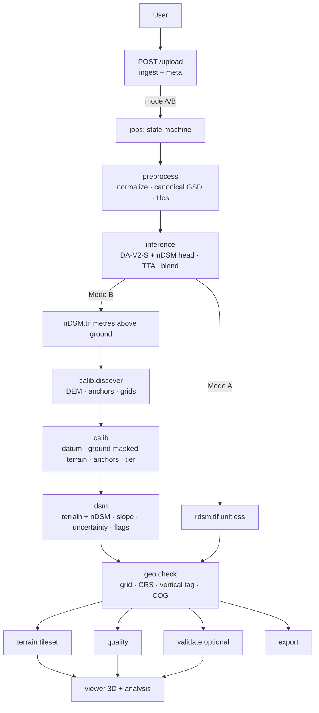
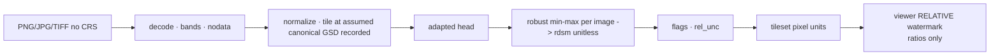
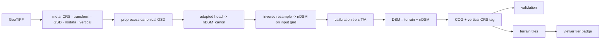
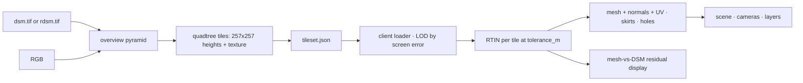
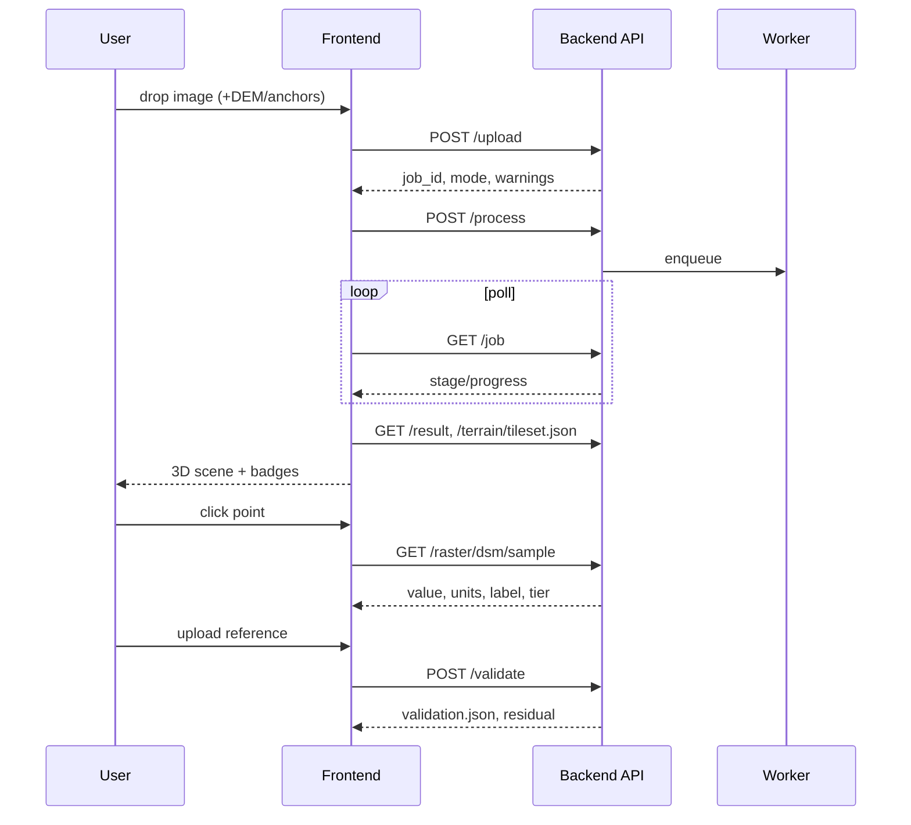

# Phase 6 — Complete System Architecture, Technical Design & Implementation Blueprint

SIH26175 DepthWizard · 2026-09-20

Scope note: Phase 6 converts the Phase 5 selected concept — **TL-CSM, the Two-Layer Calibrated Surface Model** (height-above-ground layer from an adapted monocular backbone + terrain layer from a datum-transformed, ground-masked coarse DEM, optional sparse-anchor refinement, calibration tiers R/H/T/A, uncertainty, measurement-faithful visualization) — into an implementation-ready architecture. No application or training code is written; no accuracy is claimed. Evidence tags: `[E#]` Phase 3, `[F#]` Phase 4, `[G#]` Phase 5, `[H#]` this phase.

**Inputs read:** Phase 1 (requirements/terminology/failure modes), Phase 2 (models/datasets), Phase 3 (17 gaps, 15 constraints, prior art), Phase 4 (data, validation blueprint, 15 constraints, 7 must-resolves), Phase 5 (concept selection §6, development §7, calibration §10, DSM §11, geospatial §12, uncertainty §13, validation §14, visualization §15, failure §16, MVP §24, Phase-6 mandate §27/13).

**Verified this phase**

| ID | Finding | Source | Confidence |
| --- | --- | --- | --- |
| H1 | PROJ geoid grids are bundleable offline: `us_nga_egm96_15.tif` 2.6 MB; `us_nga_egm08_25.tif` 76.9 MB. | cdn.proj.org HEAD | HIGH |
| H2 | A Copernicus GLO-30 1°×1° COG tile (e.g., N28 E077, Delhi) is ~40 MB → a demo AOI needs 1–4 tiles (≤ 160 MB). | AWS `copernicus-dem-30m` bucket HEAD | HIGH |
| H3 | Depth Anything V2 default inference `--input-size 518` (multiples of 14 for the ViT patch grid); fine-tuning code present [G2]; Small checkpoint Apache-2.0 [E26]. | run.py, repo | HIGH |
| H4 | Phase 5 decisions re-examined for technical validity: none found invalid. Two are *refined* (not replaced) below with explicit rationale: (a) GSD conditioning is implemented as canonical-GSD resampling in MVP with a scalar GSD embedding deferred to Advanced; (b) the mesh is generated client-side from server-produced DSM tiles so that the viewer's geometry is provably derived from the same raster the analysis tools read. | Phase 5 §7, §15 | — |

---

## 1. Architecture Overview & Layers

The system is a **single-user, local, offline-capable application**: one Python backend process (API + in-process job worker + ML inference + geospatial engine) serving a browser-based frontend (WebGL viewer), packaged as one installable artefact. This follows from the PS's "standalone deployment" [E1], the Phase 4 deployment criteria (clean-machine, offline) and the Phase 5 feasibility analysis (student team, one GPU or CPU). Microservices are not justified.

| Layer | Responsibility | Module(s) |
| --- | --- | --- |
| L1 Input / Ingestion | Accept PNG/JPG/TIFF/GeoTIFF (+ optional DEM, anchors, reference); validate; classify Mode A/B | `ingest` |
| L2 Image / Geo-metadata Processing | CRS, transform, GSD, nodata, bands; radiometric normalization; canonical-GSD resampling; tiling plan | `geo.meta`, `preprocess` |
| L3 Depth / Geometry Estimation | Adapted backbone → **height above local ground (metres)** or **relative height** per tile; TTA variance; blending | `inference` |
| L4 Remote-Sensing Adaptation | Offline fine-tuning pipeline (data prep, splits, training, model registry); inference-time GSD normalization and facade/quality checks | `ml.train`, `ml.registry`, `preprocess.qc` |
| L5 Scale / Elevation Calibration | Tier decision R/H/T/A; DEM ingestion & datum transform; ground-masked terrain layer; anchor fitting; failure detection | `calib` |
| L6 DSM Generation | Composition DSM = terrain + nDSM; nodata; disclosed cleanup; slope/aspect; uncertainty raster | `dsm` |
| L7 Geospatial Processing | CRS/transform bookkeeping, reprojection, resampling, COG writing, vertical-CRS tagging | `geo` |
| L8 Validation / QC | Co-registration, masks, metric set, per-class/terrain tables, residual rasters, quality report | `validate`, `quality` |
| L9 3D Reconstruction | DSM pyramid → terrain tiles (float heights) + texture tiles; client RTIN meshes with tolerance; mesh-vs-DSM residual | `terrain` (server), `viewer/mesh` (client) |
| L10 Interactive Visualization | Scene, cameras, controls, layers, measurement (raster-backed), validation panel, badges | `viewer` |
| L11 Application / API | HTTP API, job orchestration, config, logging | `api`, `jobs`, `config` |
| L12 Storage / Output | Job directories, SQLite job index, artefact contracts, exports | `store` |
| L13 Deployment | Packaging, offline assets (weights, geoid grids, demo DEM tiles, samples), demo mode | `packaging`, `assets` |

---

## 2. Master End-to-End Flow

| Stage | Input | Processing | Output | Module | Depends on | Failure conditions |
| --- | --- | --- | --- | --- | --- | --- |
| User → Upload | File(s) | Size/type/magic checks; store original; create job | Job ID, `input.*` | `api`, `ingest`, `store` | — | Unsupported/corrupt → 400 with reason |
| Input type detection | File | Decode header; GeoTIFF tags; CRS resolve; transform validity; rotation; nodata; bands | `mode ∈ {A,B}`, `meta.json` | `ingest`, `geo.meta` | GDAL/rasterio, PROJ | CRS unresolvable → Mode B refused, Mode A offered |
| Metadata extraction | GeoTIFF | CRS (EPSG/WKT), transform, bounds, pixel size, GSD (m), vertical CRS if any, RPC presence, nodata | `meta.json` | `geo.meta` | PROJ | Geographic CRS → GSD from local metre factors; flag |
| Image preprocessing | Pixels + meta | Band selection (RGB), dtype scaling, nodata mask, quality score, canonical-GSD resampling, tile plan (518 px, overlap) | Normalized tiles in memory / on disk; `prep.json` | `preprocess` | `geo.meta` | Quality below threshold → warning flag |
| Depth/geometry inference | Tiles | Adapted DA-V2-S + nDSM head; TTA; blend | `nDSM_canon.tif` (H) or `rel_canon.tif` (R); `unc_model.tif` | `inference`, `ml.registry` | Torch, weights | OOM → smaller batch/tiles → CPU; failure → partial nodata + error |
| Remote-sensing refinement | Prediction | Inverse GSD resampling to input grid; facade heuristic; range checks | `nDSM.tif` on input grid; flags | `preprocess`, `quality` | — | Out-of-range GSD → flag; extreme values → flag |
| Calibration input discovery | Job config, AOI bounds | Locate DEM tiles (bundled/user/URL), anchor file(s), reference raster; datum metadata | `calib_inputs.json` | `calib.discover`, `assets` | Offline asset index | No DEM → tier cap H |
| Scale/elevation calibration | nDSM, DEM, anchors, geoid grids | Datum transform; ground mask; ground-masked normalized-convolution terrain; anchor robust fit; consistency checks; tier | `terrain.tif`, `calib_report.json`, tier | `calib` | `geo`, PROJ grids | Checks fail → downgrade + flags |
| DSM construction | terrain + nDSM | Composition; nodata; optional disclosed cleanup; slope/aspect; uncertainty combine | `dsm.tif`, `slope.tif`, `aspect.tif`, `uncertainty.tif`, `flags.tif` | `dsm` | `calib` | Composition inconsistency → flag |
| Geospatial consistency check | All rasters | Same grid/CRS/transform/nodata; vertical CRS tag; bounds round-trip; COG validity | Verified COGs | `geo.writer`, `geo.check` | GDAL | Mismatch → job error (should not occur) |
| Validation / quality estimation | Outputs (+ reference) | Co-registration; masks; metrics; per-class/terrain; residual raster; quality states | `validation.json`, `residual.tif`, `quality.json` | `validate`, `quality` | `geo` | No reference → "not validated" |
| 3D mesh generation | `dsm.tif`, RGB | Overview pyramid; terrain tiles (float32 heights) + RGB texture tiles; tile index | `terrain/` tileset | `terrain` | GDAL | Too large → AOI/LOD cap |
| Texture projection | Tiles | Client: RTIN per tile at tolerance; UVs = raster coords; normals | Meshes in GPU memory; mesh-vs-DSM residual | `viewer/mesh` | Three.js | WebGL unavailable → 2D fallback |
| Interactive 3D scene | Meshes, rasters (via API) | Cameras, layers, badges | Scene | `viewer` | — | — |
| Analysis | Picks/polylines | Raster lookups via API; labelled values | Measurements | `viewer/analysis`, `api` | Rasters | — |
| Output export | Job artefacts | Zip: COGs, report, glTF/OBJ, PNG previews | `export.zip` | `store`, `api` | — | Disk full → error |

---

## 3. Input Architecture (L1–L2)

| Input | Metadata available | Unavailable | Preprocessing | Mode | Validation |
| --- | --- | --- | --- | --- | --- |
| PNG | Dimensions, bit depth, channels (RGB/RGBA/gray/palette) | CRS, transform, GSD, nodata (alpha may act as mask) | Convert to 8-bit RGB; alpha → nodata mask; palette expand | A | Magic bytes; dimension caps; channel normalization |
| JPG/JPEG | Dimensions, EXIF (rarely useful) | Same as PNG | Decode; quality score (blockiness/entropy) | A | Same + compression warning |
| TIFF (non-geo) | Dimensions, dtype, bands, tiling | CRS/transform | Band select; dtype scale (uint16 → percentile stretch); nodata tag if present | A | BigTIFF supported; unsupported compression → error |
| GeoTIFF | + CRS, geotransform (incl. rotation), nodata, possibly vertical CRS, RPCs, overviews | Vertical CRS usually absent; acquisition date/sensor usually absent | As TIFF + GSD derivation; nodata mask; reproject only if geographic CRS (to local UTM) with record | B | CRS resolvable via PROJ; transform finite and non-degenerate; extent on Earth; GSD within [0.1, 10] m else flag |

Edge cases:
- **GeoTIFF lacks CRS** → treated as Mode A; UI offers "supply CRS/GSD" (flag `user_supplied_georef`).
- **Incomplete metadata** (transform but no CRS, or vertical unknown) → Mode B only with user confirmation; vertical defaults to declared output datum with flag `vertical_assumed`.
- **Invalid CRS** (unresolvable WKT, off-Earth extent) → Mode B refused with reason; Mode A offered.
- **Extremely large image** → header-only read; if pixels > `max_pixels` (config, e.g., 200 MP) require AOI selection or automatic canonical-GSD downsampling with record; processing is windowed (never full-array load).
- **Unsupported TIFF structure** (multi-page, exotic compression, > 4 samples/pixel without band hint) → explicit error listing what was found; band-mapping UI for multispectral (choose R,G,B indices).
- **Unexpected channels** (1 band → replicate with warning; 4+ bands → default 1,2,3 with override; float bands → stretch).
- **Corrupted image** → decode failure → 400 with GDAL message; partial reads never proceed.

---

## 4. Image Processing Architecture (L2)

- **Normalization:** per-band percentile stretch (config, default 1–99 %) to 8-bit, then the backbone's ImageNet mean/std — matching the fine-tuning pipeline exactly (the same `preprocess` module is used in training and inference).
- **Canonical-GSD resampling:** input GSD g → nearest canonical band (config default {0.3, 0.5, 1.0, 3.0} m; must match model card); factor recorded; resample with area-averaging when downsampling, cubic when upsampling; output grid derived from the input transform so inversion is exact.
- **Tiling:** tile 518×518 (H3) at canonical GSD; overlap 64 px (config); tiles referenced by window offsets in the canonical grid; padded borders with reflect padding; border band width recorded for `flags.tif`.
- **Stitching:** cosine-feathered weights in overlaps; because predictions are metric, no per-tile normalization — a **tile-consistency statistic** (mean |Δ| in overlaps) is computed and reported (calibration failure signal).
- **Quality checks:** nodata fraction, saturation fraction, JPEG blockiness, haze proxy (contrast), cloud heuristic (very bright low-texture regions; flag only), facade heuristic (Advanced: vertical-edge density anisotropy).
- **Large-raster handling:** windowed reads via rasterio; tiles streamed to the inference batcher; predictions written windowed into a canonical-grid mosaic; memory bounded by batch size × tile.
- **Radiometric:** no atmospheric correction (not needed for 8-bit RGB); histogram matching to training distribution optional (Advanced; used in RS3DAda [E28]).
- **Where:** all preprocessing in the backend (`preprocess`), because it must be bit-identical to training and needs GDAL; the client never touches pixels except display.

---

## 5. Depth / Geometry Engine (L3)

- **Model family:** Depth Anything V2-**Small** (ViT-S/14 encoder, DPT decoder), Apache-2.0 [E26][H3], with the decoder's output head **replaced/fine-tuned to regress height above local ground in metres** (nDSM) — Phase 5 §7.3.
- **Input:** 518×518 canonical-GSD RGB tiles, ImageNet-normalized; batch size adaptive to VRAM.
- **Inference mode:** FP16 on GPU, FP32 on CPU; optional TTA (h-flip, v-flip, rot90×k) — mean = prediction, variance → `unc_model`.
- **Output representation (exact):** float32 raster **`nDSM_canon`: height above local ground, metres, ≥ 0 (clamped at 0), on the canonical grid** (Level H). In Mode A the *same head runs* but its output is re-normalized per image to [0, 1] and labelled **`rel_canon`: relative height, unitless** (Level R), because without GSD the metric scale is unknowable (Phase 5 §8). It is never called "elevation".
- **Weights & versioning:** `models/<name>/<version>/{weights.safetensors, model_card.json, preprocess.json, canonical_gsds, training_data_manifest, validation_tables.json}`; job records the model hash.
- **GPU/CPU:** device probe at start; OOM → halve batch → single tile → CPU; all recorded.
- **Post-processing:** feathered blend; inverse canonical resampling to the input grid (cubic); clamp ≥ 0; no smoothing at this stage.
- **Edge handling:** reflect-padded tiles; outer `border_px` flagged in `flags.tif` (`BORDER` bit).
- **Baseline path:** the unmodified zero-shot DA-V2-S relative head is kept as `baseline_relative` for ablations (Concept A) and as the fallback if the fine-tuned head is unavailable (then Mode B is capped at Level R + DEM offset only, clearly labelled).

---

## 6. Remote-Sensing Adaptation (L4)

INPUT → ADAPTATION → OUTPUT:

- **Offline training pipeline (`ml.train`):** 
  1. *Data preparation:* build RGB–nDSM pairs on common grids: GAMUS (0.33 m, nDSM, `.h5` → tiles) [E6]; DFC19 Track-1 (1.3 m) [E10]; swisstopo (SWISSIMAGE ortho + swissSURFACE3D − swissALTI3D → nDSM, 0.5 m) [F2][G3]; LINZ (imagery + 1 m DSM − 1 m DEM) [F3][G4]; USGS 3DEP EPT → first-return DSM & DTM raster → nDSM + NAIP (1 m) [F5][F12]. Each source: reproject to a local projected CRS, resample to canonical GSD bands, tile 518², compute terrain class per tile (slope from DTM, land cover from labels/OSM), record footprints.
  2. *Splits:* spatial blocks with buffers (Phase 4 §10); city/region hold-outs; footprint-overlap exclusion across sources (Phase 4 §33); manifest with tile IDs.
  3. *Training:* initialize from DA-V2-S; freeze/low-LR encoder, train head (+ optional decoder) with a metric loss (L1/SiLog variants) plus a long-tail-aware term (e.g., height-bin reweighting or HTC-DC-style classification-regression [E4] — chosen in Phase 7 by ablation); GSD handled by canonical resampling (MVP) and by a scalar GSD embedding added to decoder features (Advanced).
  4. *Validation tables:* per-terrain, per-class error statistics on held-out blocks → shipped in the model card and used as uncertainty priors (Phase 5 §13).
- **Inference-time adaptation:** canonical-GSD resampling; radiometric normalization; optional histogram matching (Advanced).
- **Semantic refinement (Advanced O1):** an auxiliary 6-class head (GAMUS labels) → ground/building/tree/water/road masks used for ground support, water flattening, class-wise validation.
- **Low adaptation confidence:** if GSD is outside canonical range, or quality score low, or facade heuristic fires, or tile-consistency statistic exceeds threshold → `adaptation_confidence = LOW`, tier capped (H stays H but uncertainty widened; T allowed with flag), warnings surfaced.

---

## 7. Scale / Elevation Calibration Engine (L5)

Quantities, kept as separate rasters: `rel` (Level R, unitless) → `nDSM` (Level H, metres above local ground) → `terrain` (metres, declared vertical datum) → `dsm = terrain + nDSM` (Level T/A, absolute) → GeoTIFF with vertical CRS.

**Inputs:** `nDSM.tif` (+ `unc_model.tif`), job meta (CRS, transform, GSD), DEM tiles (bundled Copernicus GLO-30 default; SRTM/AW3D30/CartoDEM/user DEM), anchors (CSV/GeoJSON: x, y, z, vertical datum, type ∈ {ground, object_top}, σ; or ICESat-2 ATL08 granules), geoid grids (EGM96, EGM2008 [H1]), optional semantic masks.

**Reference-data discovery (`calib.discover`):** compute job bounds in EPSG:4326 → look up bundled DEM tile index → else user-provided DEM → else `dem=None`. Anchors: user upload; ICESat-2 (Advanced) via pre-downloaded granules for demo AOIs. Every discovered source gets `{source, version, vertical_crs, accuracy_class}`.

**Algorithm (Level T — terrain layer):**
1. Reproject DEM to the job grid at DEM-native posting (~30 m) → `dem_coarse` with void mask; vertical transform DEM datum → declared output datum (default EGM2008, EPSG:3855) via PROJ grids; CartoDEM datum resolved by configuration after empirical test (Phase 5 §12).
2. Ground mask on the job grid: `ground = nDSM < h_ground` (config default 1.0 m) ∧ ¬nodata (∧ semantic ground if available).
3. Ground support per DEM cell: `w = fraction of ground pixels in cell` (0–1); cells with void → w = 0.
4. Terrain surface by **normalized convolution**: `terrain_coarse = (K ∗ (w·dem)) / (K ∗ w)` with Gaussian kernel K (σ config, default ≈ 1.5 DEM cells); where `K ∗ w < w_min` (config 0.1) fall back to raw `dem_coarse` and set flag `TERRAIN_RAW_DEM`; upsample `terrain_coarse` to the job grid with bicubic interpolation → `terrain.tif`. This is the Phase 5 "ground-masked low-pass": DEM cells dominated by canopy/roofs are down-weighted [E19][E21].
5. Consistency checks: `Δ = lowpass(terrain + nDSM) − dem` statistics (ME, NMAD) reported; |ME| > `datum_sanity_m` (config 15 m) → `DATUM_SUSPECT` and tier capped at H; DEM void fraction > threshold → flag.

**Algorithm (Level A — anchors):**
1. Transform anchors to job CRS and output vertical datum (ICESat-2 ellipsoidal → EGM2008 [F13][F6]).
2. Residuals: ground anchors `r_g = z_anchor − terrain(x,y)`; object anchors `r_o = z_anchor − (terrain + nDSM)(x,y)`.
3. Robust fit: offset `b` (and optional planar tilt if spread and N ≥ 10) from ground anchors via Theil–Sen/Huber; object-scale factor `a` from object anchors via RANSAC line fit of `z_anchor − terrain` vs `nDSM` (requires ≥ 5 object anchors, else a = 1 with flag).
4. Partition: if N ≥ 10, hold out 30 % (spatially stratified) as checkpoints; report held-out ME/NMAD/RMSE; anchors used are listed by ID so validation can prove disjointness [F7].
5. Acceptance: post-fit NMAD ≤ k·σ_anchor (k config 3) and spread adequate → apply, tier = A; else reject, keep T, flag `ANCHOR_FIT_REJECTED`.

**Confidence estimation:** tier + `calib_report.json` (DEM source/accuracy class, void fraction, ground-support statistics, raw-DEM fallback fraction, ME/NMAD of consistency check, anchor N/residuals/held-out residuals, datum grid versions).

**Fallback:** monotone downgrade A → T → H → R; never upgrade without a source. Mode A never enters this engine except when the user supplies GSD/CRS (then it is Mode B with `user_supplied_georef`).

Separation summary: **scale recovery** = learned metric head + GSD (H) + optional anchor scale (A); **ground elevation** = terrain layer (T); **surface height** = nDSM (H); **absolute elevation** = terrain + nDSM (T/A); **vertical datum** = declared, transformed via grids, tagged.

### 7.1 Calibration Source Priority

| Priority | Source | Required input | Expected accuracy (evidence) | Reliability | Geographic availability | Processing | Failure mode |
| --- | --- | --- | --- | --- | --- | --- | --- |
| Primary terrain | Copernicus GLO-30 | Bundled/user tiles, EGM2008 | Forest MAE 5.15 m, built-up 1.61 m raw [E19]; DEMIX best 1″ [E32] | High | Global | Reproject, datum (none if output EGM2008), ground-masked NC | Voids; canopy bias where no ground |
| Secondary terrain | SRTM v3 / NASADEM | Tiles, EGM96 | 16 m/10 m spec; 0.6–5.6 m ± 3–16 m by relief [E2][E21] | High | 60°N–56°S | + EGM96→EGM2008 (≤ 1 m in India [F13]) | Same, worse in relief |
| Tertiary terrain | AW3D30 / CartoDEM | Tiles; CartoDEM datum resolved | AW3D30 least slope-sensitive [E20]; CartoDEM 8 m LE90 [E23] | Medium | Global / India | Same | Datum ambiguity (CartoDEM) |
| Anchor refinement | User GCPs | CSV/GeoJSON with datum, σ | Survey-grade | High if provided | Wherever surveyed | Robust fit | Clustering, few points |
| Anchor refinement | ICESat-2 ATL08 | Granules for AOI | 0.7–4 m terrain by relief [F6] | Medium | Global incl. India | Ellipsoid→EGM2008; segment centroids; quality flags | Sparse tracks; canopy error |
| No-metric mode | none | — | — | — | — | Level H (metric nDSM only) or R | — |

### 7.2 Ground / Surface Separation
Mechanism (Phase 5 §11, no new model in MVP): **geometric reasoning on the model output** — `nDSM < h_ground` defines ground; buildings/trees/infrastructure are everything above; bare earth and roads fall in ground; water is ground with optional flattening (Advanced with semantic head). Terrain priors come only from the DEM through the ground-weighted normalized convolution. **Learned semantic head (Advanced O1)** refines ground support and enables class-wise metrics [E4][E5]. No separate DTM is claimed: `terrain.tif` is exported as "DEM-derived terrain layer (low-frequency), not a certified DTM".

---

## 8. DSM Construction Engine (L6)

- **Representation:** float32 metres; `dsm = terrain + nDSM` per pixel on the input grid; nodata where either is nodata.
- **Ground reference:** `terrain.tif` (declared datum). **Surface values:** first-surface semantics (canopy top, roof top).
- **Edges/discontinuities:** preserved as predicted; no isotropic smoothing; optional *disclosed* 3×3 median on `nDSM` for salt-and-pepper only when `cleanup=true` (default off), recorded in report.
- **Missing values/holes:** input nodata propagated; DEM voids handled in terrain (flag); no zero-fill ever (Phase 4 §13).
- **Noise reduction:** uncertainty raster kept unfiltered; any cleanup applied to `dsm`/`nDSM` is mirrored into `flags.tif` bit `CLEANED`.
- **Structure preservation:** DEM never touches `nDSM`; canonical→input resampling cubic; building edges thus come from the model only.
- **Output resolution:** input grid (GSD g); overviews built for COG and terrain pyramid.
- **Derived layers:** `slope.tif` (degrees, Horn 3×3 gradient with pixel size in metres), `aspect.tif`, `uncertainty.tif` (§10), `flags.tif` (bitmask: BORDER, TERRAIN_RAW_DEM, DEM_VOID, GSD_OUT_OF_RANGE, FACADE_SUSPECT, LOW_QUALITY, CLEANED, WATER).
- **Final DSM definition:** `dsm.tif` = COG float32, input CRS + transform, nodata = −9999, tags `VERTICAL_CRS=EPSG:3855` (or declared), `TIER∈{T,A}`, `TERRAIN_SOURCE`, `MODEL_HASH`, `JOB_ID`. In Mode A there is **no `dsm.tif`**; the deliverable is `rdsm.tif` (unitless) — see §10.

---

## 9. Pipelines

### 9.1 Non-Georeferenced Pipeline (Mode A)
PNG/JPG/TIFF-without-CRS → decode/normalize → (no GSD: assume canonical 1.0 m *for tiling only*, recorded) → adapted head → per-image min–max (robust 1–99 %) normalization → `rdsm.tif` (unitless [0,1], nodata) + `rel_unc.tif` → terrain tileset in pixel units → viewer with "RELATIVE" watermark. Displayable: shape, ordering, relative heights, relative slope (unitless gradient; degrees **not** shown). Measurable: normalized height, ratio between two picks, relative difference. If the user supplies a scale hint (GSD or a known object height) → outputs relabelled `metric_unverified` with the hint in metadata, still no absolute datum. Output metadata: `mode=A`, `tier=R`, `units=relative`, `scale_hint`, model hash, quality flags.

### 9.2 Georeferenced Pipeline (Mode B)
GeoTIFF → metadata (CRS, transform, GSD, nodata, vertical) → preprocessing (canonical GSD, tiles) → adapted head → `nDSM.tif` (H, metres above local ground) → calibration discovery → terrain layer (T) → optional anchors (A) → `dsm.tif` + `slope/aspect/uncertainty/flags` → geospatial consistency check → validation (if reference) → terrain tileset → viewer with tier badge and datum label → export. Preservation: every raster inherits `meta.json` CRS/transform/bounds/pixel size; nodata explicit; vertical CRS tagged; alignment guaranteed by construction (all rasters written on the input grid).

### 9.3 Geospatial Engine responsibilities (L7)

| Task | Preprocessing | Calibration | Output | Validation |
| --- | --- | --- | --- | --- |
| CRS validation / resolution | ✓ | | | ✓ (reference) |
| Reprojection | geographic→UTM if needed (recorded) | DEM/anchors → job grid | none (input grid) | reference → job grid or aggregation grid |
| Raster alignment / resampling | canonical GSD (area/cubic) | DEM bicubic; anchors point sampling | inverse canonical (cubic) | aggregation to coarser posting |
| Geotransform / bounds bookkeeping | ✓ | ✓ | ✓ | ✓ |
| Nodata | mask creation | void mask | propagate | valid-pixel mask |
| Vertical reference | read tag | transform via PROJ grids | tag compound CRS | transform reference |
| GeoTIFF/COG writing | | | ✓ | residual raster |
| Coordinate conversions (pixel↔CRS↔lon/lat) | ✓ | ✓ | ✓ | ✓ |

Implementation: one `geo` package (rasterio/GDAL + pyproj) used by all services; a single `Grid` object (CRS, transform, shape, nodata) travels with the job and every raster is asserted against it.

---

## 10. Validation & Quality Engines (L8)

**Validation (`validate`)** implements the Phase 4 blueprint:
1. Load reference (LiDAR DSM/nDSM/DTM GeoTIFF, or point checkpoints CSV); read its CRS and vertical CRS (user must declare if untagged).
2. Vertical normalization: reference → output datum via grids.
3. Spatial matching: reproject to job CRS; choose comparison grid = coarser posting (aggregate finer by block mean; block max optional for DSM semantics); pixel-centre alignment asserted.
4. Co-registration: estimate horizontal shift on stable terrain (ground mask) by minimizing dh vs slope/aspect relationship (Nuth–Kääb) or by cross-correlation of slope rasters; apply and **report the shift** [F8].
5. Valid-pixel mask: nodata of both, water (optional), border band, user change mask, flags selected.
6. Metrics: ME, RMSE, MAE, NMAD, LE90/LE95, Pearson r, Spearman ρ, fitted affine (s, t) reported for information; Mode A: metrics after affine alignment only, labelled "affine-invariant".
7. Stratification: terrain class per pixel from reference-DTM slope + land cover (config thresholds) → urban/sparse/hilly/forested tables; class tables (ground/building/tree/water) if masks exist; height-bin errors; building-instance RMSE and F1-HE when footprints/labels exist [E4][E28].
8. Outputs: `validation.json`, `residual.tif` (pred − ref on comparison grid), histograms, error-vs-slope table.
9. Guard: anchors used in calibration are subtracted from any checkpoint set (ID match + spatial radius) → `leakage_check=passed`.

**Quality (`quality`)** produces defensible states, not percentages:
- **Model confidence:** from TTA variance and validation-table priors → per-pixel `uncertainty.tif` (metres, 1σ-like); summary quantiles.
- **Calibration confidence:** HIGH = tier A with held-out anchor NMAD ≤ threshold, or tier T with ground-support ≥ 0.5 and consistency |ME| ≤ 3 m; MEDIUM = tier T with partial support or consistency 3–10 m; LOW = raw-DEM fallback > 50 % of area, `DATUM_SUSPECT`, GSD out of range, or tier H/R (no absolute). Thresholds are config and documented; states appear with their triggering values.
- **Data quality:** nodata %, saturation %, blockiness, cloud/haze flags.
- **Validation status:** `validated` (reference present, metrics computed) / `not_validated`.

---

## 11. 3D Reconstruction Engine (L9)

- **Server (`terrain`):** from `dsm.tif` (or `rdsm.tif`) build an overview pyramid; cut a **quadtree tileset**: for each level/tile a float32 (or 16-bit quantized with per-tile scale/offset) height tile of 257×257 (2ⁿ+1 for RTIN) and a JPEG/PNG texture tile from the RGB on the identical footprint; write `tileset.json` (bounds, CRS, GSD, levels, nodata, vertical exaggeration default 1.0, units, tier, datum). Heights are the DSM values — no smoothing.
- **Client (`viewer/mesh`):** per tile, RTIN (Martini-class) triangulation at a **user-visible error tolerance in metres** (default = 0.5·GSD-scaled or 0.5 m, config); vertices (x,y from tile grid × GSD, z from height), indices from RTIN, normals computed, UV = normalized tile coordinates (texture and heights share the footprint ⇒ exact draping). Skirts at tile borders hide LOD cracks. Nodata → triangles dropped (holes shown, not filled).
- **LOD:** quadtree selection by screen-space error; frustum culling; tile cache; Mode A tiles in pixel units with an arbitrary vertical unit.
- **Link to DSM:** the client computes and displays **mesh-vs-DSM residual** (sample heights at tile grid vs mesh interpolation) for the chosen tolerance; measurement tools query the **server rasters** (`/raster/{id}/sample`), never mesh vertices; the exaggeration factor applies only to rendering and is always displayed.
- **Large scenes:** tileset bounded by `max_levels`; deepest level = input GSD; memory bounded by cache size.
- **Boundaries/holes:** nodata omitted; border band rendered with hatching overlay when `flags` requested.
- **Export:** glTF (binary) of the selected level or full-resolution OBJ for small scenes; includes texture; metadata JSON with datum/tier/tolerance.

---

## 12. Visualization Engine (L10)

- **Stack:** browser WebGL viewer built with **Three.js** (decision record D-04); runs from the packaged local server; no internet.
- **Scene loading:** fetch `tileset.json` → load top level → progressive refinement; RGB texture default.
- **Cameras/controls:** *Aerial* — orbit/pan/zoom (target on terrain), fly mode (WASD + mouse look, altitude clamp above mesh); *First-person* — pointer-lock walk with eye height (config 1.7 m × exaggeration-neutral) clamped to terrain height sampled from the height tiles (collision), speed scaled to GSD; smooth transitions; bookmarks.
- **Coordinate mapping:** viewer local metres ↔ raster pixel ↔ CRS coordinates ↔ lon/lat via `meta.json`; cursor readout shows all when Mode B; pixel-only in Mode A.
- **Layers (toggle/opacity):** RGB; DSM hypsometric ramp with legend (metres, datum); nDSM ramp; slope (degrees, legend); aspect; uncertainty (metres); flags (hatching); residual (if validated); terrain-only (DEM-derived layer) to show the DEM's contribution; contour lines (derived client-side from height tiles, interval config).
- **Badges:** tier (R/H/T/A), datum, mode watermark "RELATIVE" (A) or "METRIC nDSM — NO ABSOLUTE DATUM" (H), exaggeration factor when ≠ 1, mesh tolerance and residual.
- **Measurement tools:** point (elevation + nDSM + uncertainty + slope), two-point (Δz, horizontal distance, gradient), polyline profile (elevation/slope chart), polygon (median nDSM, area) — all labelled ABSOLUTE / METRIC RELATIVE (nDSM) / RELATIVE per tier.
- **Validation panel:** upload reference → run → tables (overall, per terrain, per class), histogram, residual overlay; "not validated" state explicit.
- **Metadata panel:** `meta.json`, `calib_report.json`, model card, flags summary.
- **Accessibility/UX:** keyboard help overlay; unit toggles; SUS questionnaire link for evaluation sessions (Phase 4 §24).
- **Avoided:** atmosphere, water animation, procedural buildings, generated facades.

### 12.1 Height Analysis
| Measurement | Source | Label by tier |
| --- | --- | --- |
| Point elevation | `dsm.tif` sample (bilinear) | ABSOLUTE (T/A) — "m above EGM2008"; unavailable at H/R |
| Point height above ground | `nDSM.tif` | METRIC RELATIVE (H/T/A) — "m above local ground"; RELATIVE at R (unitless) |
| Point uncertainty | `uncertainty.tif` | metres (H/T/A) |
| Difference between two points | Δ of the above | inherits label |
| Vertical profile | sampled along polyline at GSD spacing | inherits |
| Building height | median `nDSM` within user polygon (or footprint if semantic head) | METRIC RELATIVE; note long-tail underestimation risk |
| Terrain elevation | `terrain.tif` | ABSOLUTE (T/A), "DEM-derived, low-frequency" |
| Relative height (Mode A) | `rdsm.tif` | RELATIVE, unitless; ratios only |

### 12.2 Slope Analysis
Standard terrain derivatives: Horn 3×3 finite differences on `dsm.tif` with pixel size in metres (Mode B) → slope = arctan(√(p²+q²)) in degrees, aspect in degrees from north; computed server-side (`dsm.derive`) at native grid; edges use one-sided differences and are flagged; noise: slope from a noisy DSM is noise-amplifying — the viewer shows slope with an optional 3×3 median pre-filter that is *labelled* when active; uncertainty-weighted greying of slope where `uncertainty` is high. Mode A: unitless gradient magnitude only ("relative steepness"), no degrees.

---

## 13. Backend Architecture (L11)

Modular monolith (one process, in-process worker; optional second process for inference on GPU machines). Services are Python packages with explicit interfaces.

| Service | Responsibility | Input | Output | Dependencies | Failure mode | Scaling note |
| --- | --- | --- | --- | --- | --- | --- |
| `api` | HTTP endpoints, auth-less local, request validation, static frontend | HTTP | JSON/files | FastAPI-class framework | Bad request → 4xx | Single user; async I/O |
| `jobs` | Job lifecycle, state machine, worker thread/process pool, retries | Job spec | State transitions, events | SQLite | Worker crash → job FAILED with stage | One worker default; N configurable |
| `ingest` | Decode, classify, meta extraction | File | `meta.json`, mode | `geo` | Explicit errors | — |
| `preprocess` | Normalize, resample, tile plan, QC | Pixels+meta | Tiles, `prep.json` | `geo` | Flags | Windowed |
| `inference` | Model load, batching, TTA, blend | Tiles | `nDSM/rel_canon`, `unc_model` | Torch, `ml.registry` | OOM cascade → CPU | GPU/CPU |
| `calib` | Discover, terrain, anchors, tier, report | nDSM, DEM, anchors | `terrain.tif`, report | `geo`, PROJ | Downgrade + flags | CPU |
| `dsm` | Compose, derive slope/aspect, uncertainty, flags | terrain, nDSM | rasters | `geo` | Flag | CPU |
| `geo` | CRS/transform/resample/write/check | rasters | rasters | GDAL/rasterio/pyproj | Assert errors | — |
| `validate` | Co-registration, metrics, residuals | outputs + reference | `validation.json`, `residual.tif` | `geo` | "not validated" | CPU |
| `quality` | Confidence states, flags summary | reports | `quality.json` | — | — | — |
| `terrain` | Pyramid + tileset + export | dsm/rdsm + RGB | tileset, glTF | `geo` | LOD cap | CPU |
| `store` | Job dirs, artefact registry, lifecycle, export zip | artefacts | paths/URLs | filesystem, SQLite | Disk full | — |
| `config` | Layered config (defaults → file → env → request) | — | settings | — | Validation errors | — |
| `assets` | Offline asset index: weights, geoid grids, DEM tiles, samples | — | lookups | filesystem | Missing asset → tier cap | — |
| `ml.train`, `ml.registry` | Offline training/data prep; model cards | datasets | versions | Torch, GDAL | — | Dev only |

### 13.1 API Contracts (all under `/api/v1`, JSON unless noted)

| Endpoint | Purpose | Request | Response | Sync/Async | Errors |
| --- | --- | --- | --- | --- | --- |
| `POST /upload` | Store input image (+ optional DEM/anchors/reference/scale hint) | multipart: `image`, optional `dem`, `anchors`, `reference`, `options{band_map, user_crs, user_gsd, vertical_crs}` | `{job_id, mode, meta, warnings}` | Sync (header parse only) | 400 unsupported/corrupt; 413 too large; 422 invalid CRS |
| `POST /process/{job_id}` | Start pipeline | `{profile: mvp|full, calib:{dem_source, output_vertical_crs, anchors:{holdout_fraction}}, tta, cleanup, tolerance_m, aoi}` | `{job_id, state: QUEUED}` | Async | 404; 409 already running |
| `GET /job/{job_id}` | Status | — | `{state, stage, progress, started, updated, warnings[], error?}` | Sync | 404 |
| `GET /result/{job_id}` | Artefact manifest | — | `{mode, tier, datum, artefacts:{dsm, ndsm, rdsm, terrain, slope, aspect, uncertainty, flags, report, tileset, preview}, provenance}` | Sync | 404; 409 not complete |
| `GET /raster/{job_id}/{layer}` | Download COG/PNG | `?format=tif|png&overview=n` | file | Sync | 404 |
| `GET /raster/{job_id}/{layer}/sample` | Raster lookup for tools | `?x=&y=&crs=pixel|job|4326` or `?polyline=`/`?polygon=` | `{values[], units, label, tier}` | Sync | 400 |
| `GET /terrain/{job_id}/tileset.json`, `/terrain/{job_id}/{z}/{x}/{y}.{hgt|jpg}` | 3D tiles | — | JSON / binary | Sync | 404 |
| `POST /validate/{job_id}` | Run validation | multipart reference (+`{vertical_crs, type: dsm|ndsm|dtm|points, class_mask?, footprints?}`) | `{validation_id, state}` | Async | 422 CRS/datum missing |
| `GET /validation/{job_id}` | Results | — | `validation.json` + residual URL | Sync | 404 / not_validated |
| `GET /metadata/{job_id}` | Meta, calibration report, model card, quality | — | JSON bundle | Sync | 404 |
| `GET /export/{job_id}` | Zip of artefacts | `?include=` | zip | Sync (streamed) | 404 |
| `GET /system` | Device, versions, assets present, demo mode | — | JSON | Sync | — |
| `DELETE /job/{job_id}` | Cleanup | — | 204 | Sync | 404 |

### 13.2 Job Orchestration
Asynchronous in-process worker (thread/process) with SQLite-persisted state; no external queue (single user, offline). States: `CREATED → QUEUED → PREPROCESSING → INFERENCE → CALIBRATION → DSM → GEO_CHECK → TERRAIN → QUALITY → (VALIDATION) → COMPLETE`; terminal `FAILED{stage, reason}`; `CANCELLED`. Each stage is idempotent and writes its artefacts before advancing; retry policy: INFERENCE retried with reduced batch/tiles then CPU (3 attempts); other stages retried once; resume from last completed stage on restart. Progress events streamed via server-sent events (optional) or polled.

### 13.3 Storage
`jobs/<job_id>/`: `input/` (original file, sha256), `meta.json`, `prep.json`, `pred/` (`ndsm_canon.tif` or `rel_canon.tif`, `unc_model.tif`), `calib/` (`dem_coarse.tif`, `terrain.tif`, `ground_support.tif`, `calib_report.json`, `anchors_used.geojson`, `anchors_holdout.geojson`), `out/` (`dsm.tif`|`rdsm.tif`, `ndsm.tif`, `slope.tif`, `aspect.tif`, `uncertainty.tif`, `flags.tif`, `preview.png`, `thumb.png`), `terrain/` (tileset), `validation/` (`validation.json`, `residual.tif`, plots), `quality.json`, `report.json`, `log.jsonl`, `export.zip` (on demand). Formats: COG float32 LZW for rasters, JSON for reports, JPEG/PNG for textures/previews, binary height tiles. Index: SQLite `jobs` table (id, state, mode, tier, created, model_hash, config_hash, paths). Lifecycle: configurable retention; temp files deleted on completion/failure; demo jobs marked `demo=true`.

---

## 14. Frontend Architecture

Single-page application served by the backend.

| Area | Purpose | Data consumed |
| --- | --- | --- |
| Upload | Drag-drop image; optional DEM/anchors/reference; options (band map, CRS/GSD override, output datum, anchors hold-out, tolerance) | `/system` (assets available), `/upload` response (mode, warnings) |
| Processing status | Stage progress, warnings, cancel | `/job/{id}` |
| Imagery/map view (2D) | RGB with grid/bounds; Mode B shows CRS coordinates; layer preview | `/raster/.../png`, `meta.json` |
| Elevation/DSM view (2D) | Colour-ramped rasters with legends; hover readout | `/raster/{layer}/png`, `/sample` |
| 3D flythrough | Terrain tiles, textures, cameras, layers, badges | `/terrain/...`, `meta.json`, `quality.json` |
| Analysis tools | Point/2-point/profile/polygon measurements | `/sample` |
| Validation panel | Upload reference, run, view tables/residual | `/validate`, `/validation/{id}` |
| Metadata panel | Meta, calibration report, model card, flags, provenance | `/metadata/{id}` |
| Export | Download artefacts / glTF | `/export/{id}`, `/raster/...` |
| Demo mode banner | Indicates precomputed/bundled samples | `/system` |

State: job-centric store; all numeric displays carry unit + label + tier; nothing shown in metres unless tier ≥ H (nDSM) / ≥ T (elevation).

---

## 15. Data Flow Diagrams

### A. Full System


### B. Non-Georeferenced


### C. Georeferenced


### D. Calibration
```mermaid
flowchart TD
  N[nDSM] --> GM[ground mask nDSM<h_ground]
  DEM[DEM tiles] --> RP[reproject to grid · datum -> EGM2008]
  RP --> W[ground support per DEM cell]
  GM --> W
  W --> NC[normalized convolution terrain]
  NC -->|support<w_min| RAW[raw DEM + TERRAIN_RAW_DEM flag]
  NC --> TER[terrain.tif]
  RAW --> TER
  TER --> CK[consistency: lowpass(terrain+nDSM) vs DEM]
  CK -->|ME>15m| CAP[DATUM_SUSPECT · tier<=H]
  ANC[anchors] --> DT[datum transform · split hold-out]
  DT --> FIT[robust fit offset/tilt/scale]
  FIT -->|accept| TA[tier A]
  FIT -->|reject| TT[tier T + flag]
  TER --> TT
```

### E. Validation
```mermaid
flowchart LR
  REF[reference DSM/nDSM/points + vertical CRS] --> VT[vertical transform]
  VT --> RG[reproject · aggregate to coarser posting]
  RG --> CR[co-register on ground · report shift]
  CR --> MK[valid mask: nodata · water · border · change · leakage check]
  MK --> MT[ME RMSE MAE NMAD LE95 r rho (+affine s,t)]
  MT --> ST[stratify: terrain · class · height bins · RMSE-B · F1-HE]
  ST --> OUT[validation.json · residual.tif · plots]
```

### F. 3D Rendering


### G. User Interaction


---

## 16. Module Boundaries

| Module | Purpose | Input | Output | Owner | Dependencies | Interface | Testability |
| --- | --- | --- | --- | --- | --- | --- | --- |
| `ingest` | Decode/classify/meta | file | `Meta`, mode | Backend | `geo.meta` | `ingest(path, options) -> Meta` | Unit: fixtures for each format/edge case |
| `geo` (`meta`, `grid`, `reproject`, `resample`, `vertical`, `writer`, `check`) | All CRS/transform/datum/raster I/O | rasters, `Grid` | rasters | Geo | GDAL, pyproj | pure functions on arrays + `Grid` | Unit: synthetic rasters; datum round-trips |
| `preprocess` | Normalize, canonical GSD, tiling, QC | array + `Meta` | tiles, `Prep` | ML | `geo` | `plan_tiles`, `normalize`, `qc` | Unit: determinism, inverse resampling error |
| `inference` | Model exec, TTA, blend | tiles | canon rasters | ML | Torch, `ml.registry` | `predict(tiles) -> arrays` | Integration: tiny synthetic image; determinism |
| `ml.registry` | Model versions/cards | — | model handle | ML | fs | `load(name, version)` | Unit: hash checks |
| `ml.train` (dev) | Data prep, splits, training, tables | datasets | versions | ML | Torch, GDAL | CLI | Offline |
| `calib.discover` | Locate DEM/anchors/grids | bounds, config | `CalibInputs` | Calib | `assets` | function | Unit: index lookups |
| `calib.terrain` | Datum, ground support, NC terrain, consistency | nDSM, DEM | `terrain`, report | Calib | `geo` | function | Unit: synthetic DEM/nDSM with known canopy bias |
| `calib.anchors` | Transform, split, robust fit, accept/reject | anchors, terrain, nDSM | params, residuals | Calib | `geo` | function | Unit: synthetic anchors with outliers |
| `calib.tier` | Tier decision | reports | tier, flags | Calib | — | function | Unit: rule table |
| `dsm` | Compose, derive, uncertainty, flags | rasters | rasters | Geo | `geo` | functions | Unit: slope on analytic surfaces |
| `validate` | Blueprint metrics | outputs, reference | JSON, residual | Validation | `geo` | `run(job, reference_spec)` | Unit: known-shift synthetic; metric identities |
| `quality` | States | reports | `quality.json` | Validation | — | function | Unit: rule thresholds |
| `terrain` | Pyramid/tiles/export | rasters | tileset | 3D | GDAL | function | Integration: tile continuity |
| `viewer` (`loader`, `mesh`, `camera`, `layers`, `tools`, `panels`) | UI | API | UI | Frontend | Three.js | REST | UI tests: navigation, measurement labels |
| `api`, `jobs`, `store`, `config`, `assets` | App plumbing | — | — | Backend | FastAPI-class, SQLite | REST/internal | Integration: upload→result |

No module writes another module's artefacts; only `store` knows paths; every raster passes `geo.check.assert_grid`.

---

## 17. Model / Data Versioning & Reproducibility

- **Model:** `models/<name>/<semver>/` with `weights.safetensors` (sha256), `model_card.json` (backbone, training data manifest hash, canonical GSDs, loss, epochs, seed, validation tables, licence), `preprocess.json` (stretch percentiles, mean/std, tile size, overlap).
- **Preprocessing parameters:** part of the model card; job records `preprocess_hash`.
- **Calibration method:** `calib_report.json` includes method version, kernel σ, `h_ground`, `w_min`, datum grid file names + hashes, DEM source + tile IDs + version, anchor IDs, hold-out seed.
- **Datasets (training):** manifests (`datasets/<name>/<version>/manifest.json`: source URLs, download dates, licence, tile list, split assignment, footprint polygons, overlap-check result).
- **Reference data (validation):** `validation.json` records reference file hash, declared vertical CRS, grid, co-registration shift, masks.
- **Evaluation configuration:** `eval_config.json` (metrics, thresholds, terrain-class rules, aggregation) versioned; hash stored in results.
- **Job reproducibility:** `report.json` = union of all hashes + software versions (Python, Torch, GDAL, PROJ) + device + seed; re-running the same input with the same `config_hash` and `model_hash` must reproduce artefacts bit-for-bit on the same device class (tested).

---

## 18. Performance Architecture & Hardware Profiles

Where optimization matters most: (1) tiled inference throughput (dominant cost); (2) DEM/terrain and validation raster ops on large grids (use windowed/overview processing); (3) tileset generation (GDAL overviews are fast); (4) browser tile cache and RTIN tolerance (frame time). Exact latencies are not promised; the system logs per-stage durations so Phase 8 can report measured numbers.

- **Large imagery:** never load full arrays; windowed I/O; canonical-GSD downsampling reduces pixel count when GSD < smallest canonical band; AOI selection beyond `max_pixels`.
- **GPU inference:** FP16, adaptive batch; **CPU fallback:** FP32, batch 1, same outputs (slower), progress shown.
- **Memory:** bounded by `batch × 518² × channels` + mosaic windows; DEM ops at 30 m posting are trivial; validation on comparison grid.
- **Mesh:** client RTIN per 257² tile is fast; LOD keeps triangles bounded; texture tiles JPEG.
- **Loading:** progressive tiles; previews first.
- **Export:** streamed zip.

| Profile | GPU | VRAM | RAM | Storage | Expected limitations |
| --- | --- | --- | --- | --- | --- |
| A — Development | NVIDIA consumer/cloud GPU | ≥ 8 GB | ≥ 16 GB | ≥ 100 GB (datasets subsets) | Fine-tuning of 24.8 M-param model feasible; larger backbones not planned |
| B — Hackathon demo laptop | Optional NVIDIA laptop GPU | 4–8 GB or none | ≥ 16 GB | ≥ 20 GB (weights, grids 80 MB, DEM tiles ≤ 200 MB, samples) | GPU: interactive processing of demo scenes; without GPU see C |
| C — CPU-only fallback | none | — | ≥ 16 GB | same | Inference slower (minutes for multi-MP scenes — to be measured); everything else identical; demo mode may present precomputed jobs (labelled) while live job runs |

---

## 19. Failure-Handling Architecture

| Failure | Detection | System behaviour |
| --- | --- | --- |
| Invalid/corrupt image | Decode exception, magic mismatch | 400 with GDAL/PIL message; nothing stored beyond quarantine |
| Unsupported format | MIME/extension/driver check | 400 listing supported formats |
| Missing CRS | `meta.crs is None` | Mode A; UI offers CRS/GSD entry → `user_supplied_georef` |
| Corrupt georeferencing | Unresolvable CRS, degenerate/huge transform, extent off-Earth | Mode B refused with reason; Mode A offered |
| Oversized raster | pixel count > `max_pixels` | Require AOI or accept canonical downsampling; record |
| No DEM | discovery empty | Tier H; `dsm.tif` absent; UI badge "METRIC nDSM — NO ABSOLUTE DATUM"; prompt for DEM upload |
| No GCP | anchors empty | Tier T; report states unanchored |
| Low calibration confidence | rules §10 | Tier kept, `calibration_confidence=LOW` with triggers listed; uncertainty widened |
| Depth inference failure | Exception/NaN tiles | Retry cascade; persistent → job FAILED{INFERENCE} with log; partial mosaic saved as debug |
| Insufficient memory | OOM | Batch halving → tile-by-tile → CPU; if still OOM → FAILED with guidance (AOI) |
| Mesh generation failure | tileset error / WebGL absent | Server: FAILED{TERRAIN} but rasters remain downloadable; client: 2D raster view fallback |
| Validation reference unavailable | none uploaded / CRS-datum missing | `not_validated`; 422 asks for vertical CRS |
| Rendering failure | WebGL context loss | Reload tiles; degrade to lower LOD; message |
| Datum sanity failure | consistency ME > threshold | Tier ≤ H, `DATUM_SUSPECT`, message suggests ellipsoid/geoid mismatch |

Principle: fail honestly — downgrade the claim, keep valid artefacts, explain the reason in `report.json` and UI.

---

## 20. Security / Data-Integrity

- File validation by magic bytes + GDAL driver whitelist (PNG, JPEG, GTiff); reject executables/archives; size limits.
- Filenames sanitized; all paths derived from job IDs (UUID) — no user path components (path traversal prevention).
- Temporary files in job dirs; cleanup on completion/failure; retention policy.
- Resource exhaustion: pixel caps, one running job by default, timeouts per stage, disk-space check before writing.
- Local binding (127.0.0.1) by default; no remote exposure; optional token if bound to LAN.
- Privacy: no telemetry; all processing local; demo assets are open-licensed.
- Output integrity: sha256 of every artefact in `report.json`; provenance tags in GeoTIFFs.

---

## 21. Deployment Architecture & Demo Mode

- **Decision (D-07):** local, offline-capable **desktop-packaged web application**: one executable (PyInstaller-class bundle of the Python backend incl. Torch CPU/GPU wheels, GDAL/PROJ, weights, geoid grids) that starts the local server and opens the frontend in the system browser (or an embedded WebView shell, optional). Rationale: PS "standalone deployment"; Phase 4 §25 criteria (clean machine, offline); browser WebGL gives the 3D layer without a game-engine runtime; a single process keeps the hackathon build tractable.
- **Environments:** *Development*: Python venv/conda + Node for frontend build; *Inference*: same backend, GPU optional; *Frontend*: static bundle served by backend; *Model serving*: in-process; *Geospatial*: GDAL/PROJ bundled with `PROJ_DATA` pointing to bundled grids; *Storage*: local filesystem + SQLite; *Packaging*: platform builds (Windows first, Linux second); *Containers*: Docker image for reproducible evaluation runs (optional, not the demo path).
- **Offline assets (`assets/`):** model weights (Small: ~100 MB class), geoid grids (EGM96 2.6 MB, EGM2008 76.9 MB [H1]), Copernicus GLO-30 tiles for demo AOIs (~40 MB each [H2]), sample inputs (open-licensed GeoTIFF/PNG), optional ICESat-2 granules for demo AOIs, optional reference rasters for the validation demo (licence-permitting: swisstopo/LINZ/AHN subsets).
- **Demo mode:** `demo=true` jobs use bundled samples and bundled DEM; precomputed results (for CPU-only machines) are stored as ordinary jobs flagged `precomputed_demo=true` and displayed with a persistent banner "Precomputed demonstration output (job hash …)"; the live pipeline remains runnable on the same sample so evaluators can compare hashes. Demo inputs are deterministic (fixed seeds, TTA fixed). Fallback visualization = 2D raster views if WebGL is unavailable. No fabricated results.

---

## 22. Observability

`log.jsonl` per job + application log: job state transitions with timestamps; stage durations; device, batch size, tile count, OOM events; input dimensions/GSD/mode; calibration tier and triggers; DEM source/version, void fraction, ground support stats, consistency ME/NMAD; anchor counts/residuals; output dimensions and hashes; warnings/flags; validation status and headline metrics; memory peaks (process RSS, torch max memory); frontend: frame-time percentiles and tile cache stats (optional, local only). A `GET /system` and a debug panel expose the same. No external telemetry.

---

## 23. Testing Architecture

- **Unit:** `geo` (transform inversion, pixel-centre convention, CRS round-trips, vertical transform against PROJ reference values e.g. Delhi EGM96/EGM2008 [F13], nodata propagation, COG validity); `calib` (normalized-convolution on synthetic DEM with injected canopy bias → bias reduction; anchor robust fit with outliers; tier rules; datum-sanity trigger); `dsm` (slope/aspect on analytic planes; composition nodata); `preprocess` (canonical resampling inverse error; tile plan coverage; determinism); `validate` (recovers a known synthetic shift; metric identities; leakage check); `ingest` (each format/edge case).
- **Integration:** image → tiles → inference → mosaic (tiny synthetic image with a stub model); nDSM + DEM → terrain → DSM; DSM → tileset → client mesh residual; upload → result via API with stub model.
- **System:** full pipeline on bundled samples (Mode A and B), with and without DEM/anchors; CPU and GPU; restart/resume; export.
- **Validation (scientific):** harness run on held-out LiDAR blocks (CH/NZ/US) per Phase 4 blueprint; DFC19 protocol; ablations C0–C8; results reported by Phase 8 — none asserted here.
- **UI:** navigation modes, collision clamp, measurement labels per tier, watermark in Mode A, exaggeration badge, validation panel states, WebGL-absent fallback; usability sessions with SUS.
- **Packaging:** clean-machine offline install and run (Windows, Linux).

---

## 24. Traceability Matrix

| PS Requirement | Architecture Module | Implementation Component | Validation Method | Demo Evidence |
| --- | --- | --- | --- | --- |
| Accept PNG/JPG | `ingest`, Mode A path | decoder, band normalization | Unit fixtures | Live Mode A job |
| Accept GeoTIFF/TIFF | `ingest`, `geo.meta` | CRS/transform/nodata parsing | Metadata round-trip tests | Live Mode B job |
| rDSM for non-georeferenced | `inference` (R), `dsm` (rdsm), viewer watermark | per-image normalization | Affine-invariant metrics on stripped tiles | RELATIVE badge, ratio tools |
| Absolute DSM with metric heights | `calib` (T/A), `dsm` | terrain NC + composition | LiDAR DSM per-terrain metrics (Phase 8) | Tier badge, datum label, GeoTIFF in QGIS |
| Use SRTM-class DEM or limited GCPs | `calib.discover/terrain/anchors`, `assets` | bundled Copernicus/SRTM, anchor fit | C2/C3 experiments | Calibration report panel |
| Pretrained monocular depth backbone | `inference`, `ml.registry` | DA-V2-S encoder + nDSM head | Zero-shot vs fine-tuned ablation | Model card panel |
| Scale-calibration module | `calib.tier` + report | tiers R/H/T/A | Ablations; residuals | Tier transitions when DEM removed |
| Scene statistics / semantic priors | `preprocess` (GSD), `calib` (ground mask), semantic head (Adv.) | canonical GSD; ground support | Ablation with/without masking | Terrain-only layer |
| Standard geospatial DSM output | `geo.writer`, `geo.check` | COG + vertical CRS tag | GDAL validation; overlay in GIS | Open exported file in QGIS |
| Project RGB onto 3D mesh | `terrain`, `viewer/mesh` | shared-footprint tiles, UV | Projection residuals at features | Toggle texture/DSM ramp |
| Rendering engine integration | `viewer` (Three.js) | tiles, LOD | Frame-time percentiles | Flythrough |
| First-person navigation | `viewer/camera` | pointer-lock walk + clamp | Clipping tests | Walk demo |
| Arbitrary aerial perspectives | `viewer/camera` | orbit/fly | Task tests | Fly demo |
| Structural height analysis | `viewer/tools`, `/sample` | raster-backed picks | Checkpoint comparison | Click building → nDSM |
| Slope analysis | `dsm.derive`, `viewer/layers` | Horn slope, legend | Slope RMSE vs reference | Slope layer + pick |
| Upload imagery | `api`, `viewer/upload` | multipart | Stability tests | Live upload |
| Validate against reference datasets | `validate`, validation panel | blueprint metrics, residual | Harness vs offline recomputation | Upload reference, view tables |
| RMSE / MAE / correlation vs LiDAR | `validate` | metric set | Per-terrain tables | Validation panel |
| Stability across four terrains | `ml.train` data mix; `validate` stratification | multi-terrain training; class rules | Stratified tables (Phase 8) | Per-terrain sample jobs |
| Software stability | `jobs` retries, caps, fallbacks | state machine | Crash-free suite | Repeated runs |
| Standalone deployment | `packaging`, `assets` | one executable, offline | Clean-machine test | Offline demo |
| Source + documentation | repo, `docs/` | model card, datum/tier semantics | Reproducibility checks | README/docs |

---

## 25. Technical Decision Records

| ID | Decision | Alternatives | Why chosen | Trade-off | Evidence | Risk |
| --- | --- | --- | --- | --- | --- | --- |
| D-01 | Backbone: DA-V2-**Small** + fine-tuned nDSM head | DA-V2 Base/Large; Metric3D/UniDepth; HTC-DC Net | PS-mandated pretrained monocular backbone; Apache-2.0; training code; fine-tuning evidence; CPU-feasible | Lower capacity than Large | [E26][G2][E14][E16][G5] | Accuracy ceiling; mitigated by ablation vs zero-shot |
| D-02 | Prediction target = metric height above ground (nDSM), Level H | Direct absolute DSM regression; relative-only + fit | Matches all available truth and prior results; enables two-layer composition | Needs terrain layer for absolute | [E4][E5][E12][E28] | Ground-mask circularity |
| D-03 | Terrain layer = ground-masked normalized convolution of datum-transformed DEM | Naive DEM add-back; FABDEM; learned fusion | Limits canopy/roof double counting; transparent; no extra data/licence | Only low frequency; raw-DEM fallback in closed canopy | [E19][E21][E32][F9] | Steep-relief DEM error |
| D-04 | Viewer: Three.js WebGL, client RTIN from server height tiles | CesiumJS; Babylon.js; Unity/Unreal; deck.gl | Single local scene (not globe); first-person + orbit controls available; tiles keep geometry provably = DSM; no engine runtime to package | Custom LOD/tiling work | [E25] | Performance on large scenes |
| D-05 | Backend: modular monolith, Python, in-process worker, SQLite | Microservices + Redis/Celery; Node backend | Single-user offline app; Python owns GDAL/PROJ/Torch; minimal ops | Limited concurrency | Phase 4 §25; Phase 5 §25 | Long jobs block UI → async worker |
| D-06 | Storage: filesystem job dirs + COG GeoTIFF + JSON + SQLite index | Object store; PostGIS | Offline; GIS-native; inspectable | No multi-user | Phase 4 §27 | Disk growth → retention |
| D-07 | Deployment: packaged local web app (one executable), offline assets bundled | Cloud service; Unity desktop build; pure browser | PS standalone; Phase 4 clean-machine/offline criteria | Package size (weights + 80 MB grids + DEM tiles) | [H1][H2][E25] | Packaging Torch/GDAL |
| D-08 | Output vertical datum default EGM2008 (EPSG:3855), all inputs transformed via PROJ grids | Ellipsoidal; EGM96; per-source | Copernicus default DEM datum; DEMIX best; ≤ 1 m from EGM96 in India | Grid bundling | [E3][E32][F13][H1] | Datum of user references |
| D-09 | Processing async with persisted states and resume | Synchronous | Minutes-long CPU jobs; stability | Complexity | Phase 4 §25 | Worker crash → FAILED state |
| D-10 | GSD handling: canonical-GSD resampling (MVP) → scalar GSD embedding (Advanced) | Single GSD; multi-head | Simple, exact inversion; matches training | Resampling blur | [E4] (GSD dependence) | Out-of-range GSD |
| D-11 | Uncertainty: TTA variance × validation-table priors + calibration residual | Ensembles; heteroscedastic head; none | Cheap, explainable, testable (AUSE) | Not Bayesian | [F16]; GAP-15 | Poor calibration of intervals |
| D-12 | Anchors: robust affine (offset/tilt/scale) with hold-out ≥ 30 % when N ≥ 10 | Dense fusion; none | Follows ASPRS independence; measurable | Few anchors → weak | [F7][E9][F6] | Clustered anchors |
| D-13 | Ground/surface separation by nDSM threshold (MVP), semantic head (Adv.) | Separate segmentation model | No extra model in MVP; evidence semantic aux helps later | Circularity | [E4][E5] | Canopy mislabelled ground |
| D-14 | Validation co-registration via Nuth–Kääb on ground pixels | None; image matching | DEM standard | Needs relief | [F8] | Flat scenes: shift undetermined (reported) |
| D-15 | No smoothing by default; disclosed optional cleanup | Always smooth | GAP-17 faithfulness | Noisier visuals | Phase 5 §11 | Evaluator perception |

---

## 26. Build / Buy / Adapt

| Subsystem | Classification | Why |
| --- | --- | --- |
| Backbone encoder/decoder | USE PRETRAINED + FINE-TUNE | Mandated; evidence; licence |
| nDSM head, loss, GSD conditioning | BUILD (small) | Core contribution enabler |
| Training data preparation (DSM−DTM, tiles, splits, overlap checks) | BUILD on existing libs (GDAL/rasterio, PDAL for 3DEP) | Standard tooling; correctness-critical |
| Geoid/datum transforms | USE EXISTING (PROJ grids) | Standard |
| DEM provisioning | USE EXTERNAL DATA (Copernicus/SRTM/…) | Global, open |
| Ground-masked terrain layer | BUILD | Core contribution |
| Anchor module | BUILD on standard robust estimators | Inspectable |
| Tiling/blending inference | BUILD (thin) | Standard pattern |
| Geospatial I/O, COG | USE EXISTING (rasterio/GDAL) | Standard |
| Validation harness | BUILD on existing (rasterio; xdem-style co-registration) | Must match Phase 4 |
| Slope/aspect | USE EXISTING (numpy/GDAL) | Standard |
| Terrain tiles / RTIN | ADAPT open-source RTIN (Martini-class) | Commodity |
| Viewer | BUILD on Three.js | Commodity engine, custom tools |
| API/jobs/store | USE EXISTING frameworks + BUILD glue | Standard |
| Packaging | USE EXISTING (PyInstaller-class) | Standard |

---

## 27. Implementation Workstreams

| WS | Deliverables | Depends on | Critical path | Testing | Definition of done |
| --- | --- | --- | --- | --- | --- |
| 1 Data ingestion & geo core | `ingest`, `geo` (meta, grid, reproject, resample, vertical, writer, check), fixtures | — | Yes (everything uses `geo`) | Unit | All formats/edge cases pass; datum round-trips within 1 cm of PROJ reference |
| 2 Training data & model | Dataset manifests (GAMUS + ≥ 1 LiDAR source), splits with overlap check, fine-tuned DA-V2-S nDSM head v1, model card with validation tables, zero-shot baseline | WS1 (geo for data prep) | Yes (accuracy) | Held-out blocks | v1 beats zero-shot on held-out blocks; card complete |
| 3 Inference service | Tiling, batching, TTA, blend, inverse resampling, device fallback | WS1, WS2 weights (stub until ready) | Yes | Integration | Deterministic mosaic; OOM cascade works |
| 4 Calibration | discover, terrain NC, anchors, tier, report; bundled DEM index; grids | WS1, WS3 outputs | Yes | Unit synthetic + integration | Tier logic verified; canopy-bias reduction shown on synthetic; report schema stable |
| 5 DSM & derivatives | composition, slope/aspect, uncertainty, flags, COG tags | WS4 | Yes | Unit | Grid/CRS/vertical checks pass |
| 6 Validation & quality | blueprint harness, co-registration, stratification, residuals, quality states, DFC19 protocol runner | WS1, WS5 | Parallel | Synthetic + real | Recovers synthetic shift; tables produced; leakage check |
| 7 Terrain tiles & viewer mesh | pyramid, tileset, client RTIN, LOD, residual display, export | WS5 (or synthetic DSM) | Parallel | Integration | Mesh residual ≤ tolerance; holes/skirts correct |
| 8 Frontend | upload/status/2D/3D/tools/validation/metadata/export; badges; Mode A watermark | WS7, API stubs | Parallel | UI | All tools labelled by tier; SUS session run |
| 9 Backend/API/jobs/store | endpoints, state machine, resume, storage, config, logging | WS1 | Yes early (stubs) | Integration | upload→result with stub model |
| 10 Integration, packaging, demo | end-to-end runs, offline bundle, demo assets, clean-machine test, docs | All | Final | System | Offline run on clean machine; demo jobs reproducible |

### 27.1 Team Parallelization (6-member team assumed; roles, not names)

| Member | Workstreams | Dependencies | Handoff |
| --- | --- | --- | --- |
| M1 Geo/Data engineer | WS1, WS4 (terrain, discover), WS5 | — | `geo` API to all; `Grid` contract; report schema to M3/M5 |
| M2 ML engineer | WS2, WS3, uncertainty | WS1 data prep helpers | weights + model card to M1/M3; canonical GSDs to preprocess |
| M3 Backend engineer | WS9, WS10 packaging, `assets`, demo mode | WS1 interfaces | API contracts to M5/M6 early (stubs) |
| M4 Validation/scientist | WS6, experiment plan, DFC19 protocol, ablations, datum tests | WS1, WS5 | `validation.json` schema to M5; results to docs |
| M5 3D/viewer engineer | WS7, viewer mesh/camera/layers | tileset contract from M3 | tileset.json schema; mesh residual |
| M6 Frontend engineer | WS8, UX, badges, panels, SUS | API stubs (M3), viewer core (M5) | UI to integration |

Parallelizable from day one: WS1/WS9/WS7/WS8 with synthetic DSMs and stub model; WS2 runs independently on data; integration points: `Grid`/`Meta` contract (day 1), API stubs (day 1–2), tileset schema (day 2), model card v1 (mid), report schemas (mid).

---

## 28. MVP Architecture vs Full Architecture

**MVP (proves the core PS):** `ingest` + `geo` core; `preprocess` (canonical GSD, tiles); `inference` with fine-tuned DA-V2-S v1 (+ zero-shot baseline); `calib` Level T from bundled Copernicus/SRTM with datum transform and ground-masked NC (anchors optional, off if no file); `dsm` + slope + flags; COG outputs with vertical tag; `validate` core (co-registration, mask, metric set, per-terrain when class raster given, residual); `terrain` tiles + Three.js viewer (orbit + first-person, RGB/DSM/slope layers, point/2-point tools, tier badge, Mode A watermark, tolerance display); `api/jobs/store`; packaged offline build with demo samples. Excluded from MVP: uncertainty raster (basic TTA optional), anchors UI, semantic head, profile/polygon tools, contour layer, glTF export, SSE progress.

**Full:** everything above plus anchors (GCP + ICESat-2) with hold-out and residual reporting; uncertainty raster + AUSE evaluation + overlay; semantic head and class-wise metrics; facade/quality heuristics; profile/polygon tools; contours; residual overlay; glTF/OBJ export; DFC19 protocol runner; cross-country experiment scripts; India ICESat-2 assessment scripts; observability panel; resume-on-restart; retention; Linux build; Docker for evaluation reproducibility.

---

## 29. Architectural Red Team

| Risk | Cause | Detection | Mitigation | Residual |
| --- | --- | --- | --- | --- |
| Scale pipeline fails (wrong metres) | GSD outside canonical bands; morphology shift | GSD flag; tile-consistency stat; anchor scale check; validation tables | Canonical bands; uncertainty; anchors; per-terrain reporting | Medium (Indian morphology) |
| Absolute elevation underdetermined | No DEM and no anchors | discovery empty | Tier H only; no `dsm.tif`; explicit label | None (by design) |
| Coarse DEM distorts buildings | Naive add-back | Design excludes DEM from nDSM; consistency check | NC on ground only; DEM only low-pass | Low |
| Vegetation false surface heights | Canopy first-surface; no ground support | `TERRAIN_RAW_DEM` fraction; forest class | Flag + raw-DEM fallback; forest validation; semantic head (Adv.) | Medium-High |
| Domain shift corrupts depth | Sensor/radiometry | Quality score; validation on external sensors | Multi-source training; normalization; ablations | Medium |
| Raster alignment systematic error | Pixel-centre/corner, resampling drift | `geo.check` asserts; synthetic shift tests | Single `Grid`; exact inverse resampling; co-registration in validation | Low |
| 3D view hides bad DSM | Smoothing, exaggeration | Mesh residual, badges | No smoothing default; tolerance display; raster-backed tools; uncertainty overlay | Low-Medium |
| Browser bottleneck | Large tilesets | Frame-time logs | LOD, tile cache, tolerance | Medium |
| GPU memory exceeded | Large batch/tiles | OOM events | Cascade to CPU | Low |
| Missing metadata silently corrupts | Vertical CRS absent; band order | Flags `vertical_assumed`, band map UI | Explicit defaults + flags; refusal for invalid CRS | Low-Medium |
| Validation leaks calibration | Same anchors/points | `leakage_check` | ID + radius exclusion; hold-out | Low |
| Too complex for hackathon | Scope creep | WS burn-down | MVP/Full split; stub-first integration | Medium |
| Datum mix-up (24–99 m) | Untagged inputs | `DATUM_SUSPECT` | Sanity check; declared datum; grids bundled | Low |
| Packaging Torch+GDAL | Wheel conflicts | Clean-machine test early | Pin versions; CPU wheel default; GPU optional | Medium |

---

## 30. Technology Stack (recommended after design)

| Component | Recommended | Alternative | Why | Trade-off | Licensing | Compute |
| --- | --- | --- | --- | --- | --- | --- |
| Language (backend/ML/geo) | Python 3.11 | — | Torch, GDAL, PROJ ecosystem | Packaging size | PSF | — |
| Deep learning | PyTorch (+ safetensors) | ONNX Runtime for CPU inference | DA-V2 code is PyTorch; fine-tuning | Size | BSD/Apache | GPU optional |
| Backbone | Depth Anything V2-Small (ViT-S/14, DPT) | DA-V2-Base (non-commercial) | Apache-2.0; PS-compliant; light | Capacity | Apache-2.0 [E26] | ~25 M params |
| Geospatial I/O | rasterio + GDAL; pyproj (PROJ) | GDAL CLI only | Standard, COG, CRS/vertical grids | Binary deps | MIT/BSD (rasterio, pyproj), MIT/X (GDAL/PROJ) | CPU |
| Point-cloud prep (training only) | PDAL | LAStools (proprietary) | 3DEP EPT → DSM/DTM | Setup | BSD | Dev |
| Numerics | NumPy, SciPy (normalized convolution, robust fits), scikit-learn (RANSAC/Theil–Sen) | — | Standard | — | BSD | CPU |
| API | FastAPI + Uvicorn | Flask | Async, typed contracts, docs | — | MIT/BSD | — |
| Jobs | in-process worker (threading/multiprocessing) + SQLite | Celery/Redis | Single-user offline | No distributed scale | — | — |
| Frontend | TypeScript + Vite; Three.js; small UI toolkit | React optional | WebGL, controls (Orbit/PointerLock), custom tools | Custom LOD | MIT | Browser GPU |
| Terrain mesh | Martini-class RTIN (JS) | Delatin | Error-bounded, fast | Grid-size 2ⁿ+1 | ISC/MIT | Browser |
| Charts (profiles, histograms) | lightweight chart lib | — | Profile/validation plots | — | MIT | — |
| Packaging | PyInstaller (+ optional Tauri/Electron shell) | Docker only | Single executable, offline | Size | GPL-with-exception/MIT | — |
| DEM data | Copernicus GLO-30 (AWS COG), SRTM v3 | AW3D30, CartoDEM | Best-ranked; open | Registration for CDSE (AWS anonymous) | Copernicus licence / PD | — |
| Geoid grids | PROJ `us_nga_egm96_15.tif`, `us_nga_egm08_25.tif` | — | Offline datum transforms | 80 MB | PD (NGA) | — |
| Anchors (Adv.) | ICESat-2 ATL08 via earthaccess | GEDI | India-capable | Sparse | PD | — |
| Testing | pytest; Playwright (UI) | — | Standard | — | MIT/Apache | — |
| Docs | Markdown + model cards | — | — | — | — | — |

---

## 31. Repository Structure

```
depthwizard/
  backend/            # FastAPI app, routers, schemas (api), jobs state machine (jobs), store, config, assets index
  core/
    geo/              # meta, grid, reproject, resample, vertical (PROJ grids), writer (COG), check
    preprocess/       # normalize, canonical GSD, tiling plan, QC heuristics
    inference/        # model loading, batching, TTA, blending, inverse resampling, baseline path
    calib/            # discover, terrain (normalized convolution), anchors (robust fit), tier, report schema
    dsm/              # composition, derive (slope/aspect), uncertainty, flags
    validate/         # co-registration, masks, metrics, stratification, residuals, leakage check
    quality/          # confidence states
    terrain/          # pyramid, tileset, export (glTF/OBJ)
  ml/
    data/             # dataset manifests, download scripts, DSM−DTM derivation, tiling, splits, overlap checks
    train/            # fine-tuning entry points, losses, GSD conditioning, model card generation
    eval/             # DFC19 protocol runner, ablations C0–C8, cross-country scripts, AUSE
  models/             # versioned weights + model cards (large files via release assets)
  assets/             # geoid grids, demo DEM tiles, sample inputs, demo reference subsets (licence notes)
  frontend/           # Vite + TS: viewer (loader, mesh RTIN, cameras, layers, tools), panels, upload/status
  scripts/            # packaging, asset fetching, clean-machine test, benchmark logging
  tests/              # unit / integration / system / ui / fixtures (synthetic rasters)
  docs/               # architecture, datum & tier semantics, output contracts, user guide, licence manifest
  configs/            # default.yaml, profiles (mvp/full/demo), eval_config.json
```

---

## 32. Configuration Strategy

Configuration-driven (YAML + env + per-request overrides; validated schema; hash recorded per job): model name/version/path; canonical GSD bands; tile size/overlap; stretch percentiles; TTA set; device policy; `max_pixels`, AOI policy; `h_ground`, NC kernel σ, `w_min`, `datum_sanity_m`; DEM source priority and tile index paths; output vertical CRS; anchor hold-out fraction, acceptance k, min N; cleanup on/off; slope pre-filter; confidence thresholds; validation aggregation rule, terrain-class thresholds (slope degrees, land-cover mapping), metric list; tileset tile size, max levels, default tolerance, exaggeration default; retention; logging level; demo mode flags. Scientific parameters are never hard-coded; defaults live in `configs/default.yaml` and are echoed into `report.json`.

---

## 33. Output Contracts

| Output | Mode | Format | Dimensions | Units | Coordinate reference | Nodata | Provenance |
| --- | --- | --- | --- | --- | --- | --- | --- |
| `rdsm.tif` | A | GeoTIFF float32 (no CRS) | input W×H | relative [0,1] (or `metric_unverified` with hint) | pixel grid | −9999 | `report.json`: model hash, normalization percentiles, tier R, flags |
| `rel_unc.tif` | A | GeoTIFF float32 | input | relative | pixel | −9999 | same |
| `ndsm.tif` | B | COG float32 | input | metres above local ground | input CRS + transform | −9999 | tier ≥ H; model hash; canonical GSD; TTA |
| `terrain.tif` | B (T/A) | COG float32 | input | metres, declared vertical CRS | input CRS; `VERTICAL_CRS` tag | −9999 | DEM source/version/tiles; datum grids; NC params; support stats |
| `dsm.tif` | B (T/A) | COG float32 | input | metres, declared vertical CRS (default EPSG:3855) | input CRS; compound tag | −9999 | tier; terrain + nDSM hashes; anchors used |
| `slope.tif`, `aspect.tif` | B | COG float32 | input | degrees | input CRS | −9999 | method (Horn), pre-filter flag |
| `uncertainty.tif` | B (Full) | COG float32 | input | metres (1σ-like) | input CRS | −9999 | TTA set, priors table version, calibration residual |
| `flags.tif` | A/B | COG uint16 bitmask | input | — | input CRS or pixel | 0 | bit dictionary in report |
| `calib_report.json` | B | JSON | — | — | — | — | tier, sources, checks, residuals, hold-out results |
| `validation.json`, `residual.tif` | B/A | JSON, COG | comparison grid | metres (A: after affine) | job CRS | −9999 | reference hash, datum, shift, masks, eval config hash |
| `quality.json` | A/B | JSON | — | states + triggers | — | — | thresholds version |
| `terrain/` tileset | A/B | `tileset.json`, height tiles (float32/uint16+scale), JPEG textures | quadtree | metres (B) / relative (A) | job CRS or pixel | omitted triangles | tolerance default, exaggeration default |
| `export.zip` | A/B | zip | — | — | — | — | manifest with sha256 |
| `report.json` | A/B | JSON | — | — | — | — | all hashes, versions, config, device, durations |

---

## PHASE 6 COMPLETE

**1. Final Architecture in One Paragraph.** DepthWizard TL-CSM is a single-process, offline-capable local web application: a Python backend (FastAPI-class API, in-process job worker, SQLite index, filesystem job stores) hosts a fine-tuned Depth Anything V2-Small model whose head predicts metric height above local ground on canonical-GSD tiles, a calibration engine that builds a datum-transformed, ground-masked normalized-convolution terrain layer from bundled coarse DEMs and optionally refines it with robustly fitted sparse anchors under explicit tiers R/H/T/A, a DSM engine that composes terrain + nDSM with slope/uncertainty/flag derivatives, a geospatial core that guarantees every raster shares the input grid with CRS, transform, nodata and a declared vertical CRS, a validation harness implementing the Phase 4 blueprint, and a terrain tiler feeding a Three.js viewer that builds RTIN meshes from the same DSM tiles at a disclosed tolerance, offers first-person and aerial navigation, and answers every measurement from the rasters with tier-labelled units — all packaged as one installable, offline artefact with bundled weights, geoid grids and demo DEM tiles.

**2. One-Line Pipeline.** Upload → detect mode/meta → normalize + canonical-GSD tiles → adapted backbone → nDSM (H) or relative (R) → DEM/anchor discovery → datum transform → ground-masked terrain (T) → anchor refinement (A) → DSM = terrain + nDSM → COG + vertical tag → validation/quality → terrain tiles → RTIN mesh + RGB drape → first-person/aerial viewer with raster-backed height/slope tools → export.

**3. Complete Component List.** `ingest`, `geo` (meta, grid, reproject, resample, vertical, writer, check), `preprocess`, `inference`, `ml.registry`, `ml.train`, `ml.data`, `ml.eval`, `calib.discover`, `calib.terrain`, `calib.anchors`, `calib.tier`, `dsm` (compose, derive, uncertainty, flags), `validate`, `quality`, `terrain`, `viewer` (loader, mesh, camera, layers, tools, panels), `api`, `jobs`, `store`, `config`, `assets`, `packaging`.

**4. Complete Data Flow.** §2 table and diagrams A–G (§15).

**5. ML Pipeline Summary.** Multi-source RGB–nDSM tiles (GAMUS, DFC19, swisstopo DSM−DTM, LINZ DSM−DEM, 3DEP+NAIP) at canonical GSDs with blocked splits and overlap exclusion → fine-tune DA-V2-S with metric + long-tail-aware loss → model card with per-terrain validation tables → inference: 518-px tiles, FP16/FP32, TTA, feathered blend, inverse resampling; zero-shot baseline retained.

**6. Calibration Pipeline Summary.** Tier R (no GSD) → H (metric nDSM from model + GSD) → T (Copernicus/SRTM/AW3D30/CartoDEM reprojected, datum→EGM2008, ground-weighted normalized convolution, raw-DEM fallback flagged, consistency/datum sanity) → A (GCP/ICESat-2 anchors transformed, hold-out split, robust offset/tilt/scale, acceptance test) with monotone downgrade and a full report.

**7. DSM Pipeline Summary.** `dsm = terrain + nDSM` on input grid; nodata propagation; no default smoothing (disclosed optional cleanup); Horn slope/aspect; uncertainty = TTA variance × priors + calibration residual; flags bitmask; COG float32 with compound vertical CRS tag.

**8. Geospatial Pipeline Summary.** One `Grid` per job; CRS/transform/bounds/pixel size preserved; geographic inputs reprojected to UTM with record; DEM/anchors/reference brought *into* the job grid; PROJ geoid grids for vertical transforms; COG writer + assertion checks; pixel↔CRS↔lon/lat services.

**9. Validation Pipeline Summary.** Reference → vertical transform → coarser-posting aggregation → Nuth–Kääb co-registration (shift reported) → masks (nodata/water/border/change/leakage) → ME/RMSE/MAE/NMAD/LE95/r/ρ (+ affine s,t; Mode A affine-invariant only) → terrain/class/height-bin stratification, RMSE-B, F1-HE → `validation.json` + `residual.tif`.

**10. 3D Visualization Pipeline Summary.** DSM/rDSM + RGB → overview pyramid → quadtree 257² height + texture tiles → client RTIN at disclosed tolerance with skirts and holes → LOD by screen error → orbit/fly + pointer-lock first-person with terrain clamp → layers (RGB/DSM/nDSM/slope/aspect/uncertainty/flags/residual/terrain-only/contours) → raster-backed measurements with tier labels → mesh-vs-DSM residual and exaggeration badges.

**11. Backend / API Summary.** Modular monolith; `/upload`, `/process`, `/job`, `/result`, `/raster/{layer}[/sample]`, `/terrain/...`, `/validate`, `/validation`, `/metadata`, `/export`, `/system`; async persisted job state machine with retry/resume; SQLite + job directories.

**12. Frontend Summary.** SPA: upload/options, status, 2D imagery and raster views, 3D flythrough, analysis tools, validation panel, metadata panel, export, demo banner; every number carries unit + label + tier; Mode A watermark.

**13. Deployment Summary.** One packaged executable (backend + frontend + weights + geoid grids + demo DEM tiles + samples), binds to localhost, opens browser; offline; Windows first, Linux second; demo mode with clearly labelled precomputed jobs; Docker image optional for evaluation reproducibility.

**14. MVP Build Order.** (1) `geo` core + `ingest` + fixtures; (2) API/jobs/store with stub model; (3) preprocessing + inference with zero-shot baseline; (4) terrain tiles + viewer mesh/cameras; (5) calibration Level T + DSM + COG tags; (6) validation core; (7) fine-tuned model v1 swapped in; (8) frontend panels/tools/badges; (9) packaging + demo assets + clean-machine test.

**15. Full Build Order.** MVP → anchors module + UI → uncertainty raster + overlay + AUSE → semantic head + class metrics → quality heuristics (facade/cloud) → profile/polygon/contours → glTF export → DFC19/cross-country/India scripts → observability panel, resume, retention → Linux build, Docker.

**16. Top 15 Architecture Risks.** Indian-morphology scale error; steep-relief terrain error (DEM-bounded); forest raw-DEM fallback; long-tail high-rise underestimation; sensor/radiometric shift; GSD out of canonical range; ground-mask circularity; datum of user-supplied inputs; packaging Torch/GDAL offline; CPU-only demo latency; browser performance on large tilesets; training-data preparation time; hidden footprint overlap; anchor clustering; scope creep.

**17. Top 15 Technical Decisions.** D-01 DA-V2-Small + nDSM head; D-02 target = metric height above ground; D-03 ground-masked normalized-convolution terrain; D-04 Three.js + client RTIN from server tiles; D-05 modular monolith; D-06 filesystem + COG + SQLite; D-07 packaged offline local web app; D-08 EGM2008 default output datum via PROJ grids; D-09 async persisted jobs; D-10 canonical-GSD resampling; D-11 TTA-based uncertainty; D-12 robust anchors with hold-out; D-13 threshold ground separation (semantic head Advanced); D-14 Nuth–Kääb co-registration; D-15 no default smoothing.

**18. PS-to-Architecture Traceability.** §24 matrix — every explicit PS requirement maps to a module, component, validation method and demo evidence.

**19. Recommended Technology Stack.** Python 3.11, PyTorch, Depth Anything V2-Small (Apache-2.0), rasterio/GDAL, pyproj/PROJ (+ EGM96/EGM2008 grids), PDAL (training only), NumPy/SciPy/scikit-learn, FastAPI/Uvicorn, SQLite, TypeScript/Vite, Three.js, Martini-class RTIN, PyInstaller (+ optional shell), Copernicus GLO-30/SRTM tiles, ICESat-2 via earthaccess (Advanced), pytest/Playwright.

**20. Proposed Repository Structure.** §31.

**21. What Phase 7 Must Implement.** Concrete task breakdown and schedule per workstream (§27) with stub-first integration; data acquisition plan (AOI subsets for CH/NZ/US, GAMUS, DFC19) and manifests; fine-tuning recipe and ablation plan (loss, GSD conditioning, long tail); calibration parameter defaults and synthetic tests; validation harness against Phase 4 blueprint incl. DFC19 protocol; tileset/RTIN implementation and viewer tools; API/job/state implementation; packaging scripts and asset bundling; clean-machine test procedure; demo-mode assets and labelling; documentation (datum/tier semantics, output contracts, licence manifest).

READY FOR PHASE 7 — IMPLEMENTATION PLANNING
