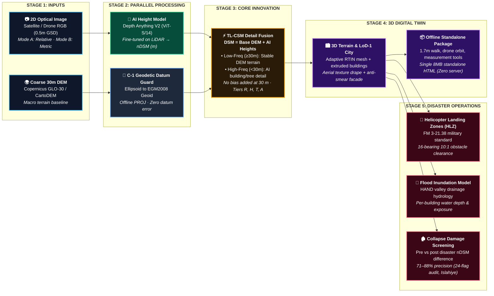

# DepthWizard — Best Technical Approach Architecture Flowchart

This document contains the definitive, jury-grade architecture flowchart for DepthWizard's **Technical Approach Slide** (designed for ISRO SIH 26175).

---

## 1. Master Flowchart (Mermaid)

> **Copy-paste this directly** into any Mermaid renderer (Markdown, GitHub, Notion, Canva, Mermaid Live Editor, or PowerPoint Mermaid plugin).



---

## 2. Text / ASCII Schematic (For Quick Notes & Slide Layout)

```
[ STAGE 1: INPUTS ]             [ STAGE 2: PROCESSING ]        [ STAGE 3: CORE FUSION ]        [ STAGE 4: 3D TWIN ]         [ STAGE 5: DISASTER OPS ]
┌───────────────────────────┐   ┌───────────────────────────┐   ┌───────────────────────────┐   ┌────────────────────────┐   ┌────────────────────────┐
│ 📷 2D Optical Image       ├──►│ 🤖 AI Height Model        ├──►│ ⚡ TL-CSM Fusion          ├──►│ 🏙️ 3D Terrain + City   ├──►│ 🚁 Helicopter HLZ      │
│ (Satellite / Drone RGB)   │   │ (Depth Anything V2 LiDAR) │   │ DSM = Base DEM + AI Detail│   │ (LoD-1 Extruded Blocks)│   │ (FM 3-21.38 10:1 Clearance)│
└───────────────────────────┘   └───────────────────────────┘   │ • ≥30m: Base DEM terrain  │   └───────────┬────────────┘   ├────────────────────────┤
                                                                │ • <30m: AI object heights │               │                │ 🌊 HAND Flood Model    │
┌───────────────────────────┐   ┌───────────────────────────┐   │ No bias added at 30 m     │               ▼                │ (Per-building depth)   │
│ 🌍 Coarse 30m DEM         ├──►│ 📐 Geodetic Datum Guard   ├──►│ Tiers: R · H · T · A      │   ┌────────────────────────┐   ├────────────────────────┤
│ (Copernicus GLO-30)       │   │ (EGM2008 Geoid Alignment) │   └───────────────────────────┘   │ 📦 Offline 8MB HTML    │   │ 🏚️ Collapse Screening  │
└───────────────────────────┘   └───────────────────────────┘                                   │ (Walk/Fly, zero server)│   │ (Pre/post damage 71-88%)│
                                                                                                └────────────────────────┘   └────────────────────────┘
```

---

## 3. The 45-Second Judge Presentation Script

When this slide is on the screen, deliver these 4 points:

1. **The Problem & Inputs:**
   > *"A single 2D satellite photo gives sharp visual details but has zero elevation data. Coarse 30m DEMs give regional terrain but miss every building and tree. DepthWizard takes both as inputs."*

2. **Parallel Processing:**
   > *"In parallel, our fine-tuned Depth Anything V2 model predicts object heights in metres, while our Geodetic Datum Guard locks the base DEM to the global EGM2008 geoid datum to eliminate vertical shift errors."*

3. **The Core Innovation (TL-CSM Fusion):**
   > *"Instead of hallucinating heights, our TL-CSM multiscale fusion preserves the reliable base DEM for macro terrain (≥30m) and injects the AI model's sharp structural details (<30m). It adds no bias at the DEM's 30 m scale, and against LiDAR it cut the DSM error by 14–40 % on every Swiss test tile; on Sikkim it improved the DSM on 5 of 6 sites."*

4. **Deliverables & Tactical Disaster Operations:**
   > *"From this fused DSM, we extrude LoD-1 3D city blocks and package everything into an offline 8MB HTML file that responders can run on any laptop without internet. On top of this digital twin, we execute three critical disaster tools: automated **helicopter landing zone screening**, **HAND flood inundation modeling**, and **post-disaster building collapse detection**."*
