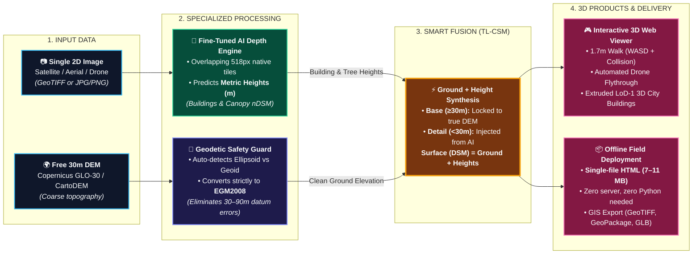

# DepthWizard — Simplified Technical Approach Architecture Slide

## The Core Concept (Understood in 5 Seconds)
> **"The Image measures how tall things are. The DEM measures where the ground is. DepthWizard combines them into a calibrated 3D world."**

```
 2D Satellite Image ─────────► [ AI Model ] ────────► Building & Tree Heights
                                                             │
                                                             ▼ (Merge: Ground + Heights)
 Coarse 30m DEM     ─────► [ Geodetic Guard ] ──► Real Ground Elevation ────────► Calibrated 3D Scene
```

---

## 1. The Slide-Ready Flowchart (Mermaid)



---

## 2. Slide Layout Grid (Drop-in for PowerPoint / Canva / Keynote)

Four simple cards left-to-right that tell the complete story:

```
┌─────────────────────────────────────────────────────────────────────────────────────────────────────────────────┐
│                                       DEPTHWIZARD: TECHNICAL APPROACH                                           │
│               How we turn a single 2D image into certified, interactive 3D terrain                              │
├───────────────────┬──────────────────────┬───────────────────────────┬──────────────────────────────────────────┤
│ 1. INPUTS         │ 2. DUAL-STREAM AI    │ 3. SMART FUSION (TL-CSM)  │ 4. INTERACTIVE 3D & FIELD EXPORT         │
├───────────────────┼──────────────────────┼───────────────────────────┼──────────────────────────────────────────┤
│ 📷 2D Optical RGB │ 🤖 AI Height Stream  │ ⚡ Ground + Detail Merge   │ 🎮 Interactive 3D Web Explorer           │
│   • Satellite /   │   • Fine-tuned ViT   │   • Surface = Base + High-│   • 1.7m First-Person Walk (WASD)        │
│     Aerial / Drone│     on LiDAR nDSM    │     frequency AI Detail   │   • Automated Drone Flythrough           │
│   • Any standard  │   • Outputs real     │   • Preserves DEM macro-  │   • LoD-1 Extruded 3D City Blocks        │
│     format        │     heights in metres│     accuracy (≥30m)       │                                          │
│                   │                      │   • No bias added at the  │ 📦 Offline Tactical Delivery             │
│ 🌍 Coarse 30m DEM │ 📐 Geodetic Stream   │     DEM's 30 m scale      │   • 1-Click Single-File HTML (7-11MB)    │
│   • Copernicus or │   • Auto-converts to │                           │   • Runs offline without server or Python│
│     ISRO CartoDEM │     EGM2008 Datum    │ 🏷️ Transparent Quality     │   • Standard GIS Pack (COG + GLB + GPKG) │
│   • Readily       │   • Eliminates 30-90m│   • Tiers: Relative, Met- │                                          │
│     available free│     vertical error   │     ric, DEM, Anchored    │ 🚨 Disaster Change Screening             │
│                   │                      │   • Provenance on every px│   • Building collapse detection          │
└───────────────────┴──────────────────────┴───────────────────────────┴──────────────────────────────────────────┘
```

---

## 3. Presenter Pitch (The 30-Second Script)

> *"Judges, the reason standard AI depth fails in real-world geospatial applications is simple: **a single image has no absolute scale, and a free DEM has no building details.**
>
> DepthWizard solves this with a clean dual-stream approach:
> 1. **Our AI model** looks at native-resolution image tiles and extracts **metric heights of buildings and trees above ground**.
> 2. **Our geodetic engine** fixes the coarse DEM, locking it strictly to the **EGM2008 vertical datum**.
> 3. **Smart Fusion** joins them together: Surface equals Ground plus Height. Because we preserve the DEM at its own scale, our output **adds no bias at the DEM's 30 m scale**, and against LiDAR it cut the surface error by 14–40 % on every Swiss test tile (better on 5 of 6 Sikkim sites).
> 4. Finally, everything runs locally and exports into a **single 8MB offline HTML file**—meaning field teams and disaster responders can fly through and measure the 3D scene anywhere on a laptop with zero internet or server setup."*
