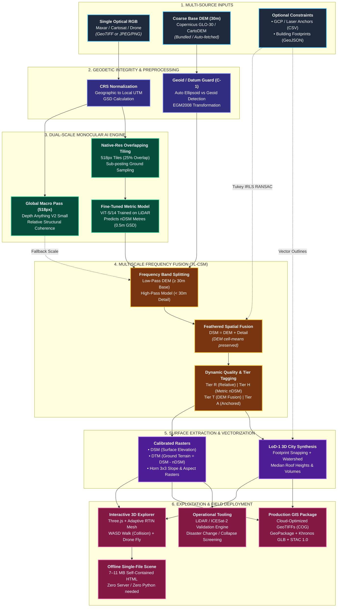

# DepthWizard — Technical Approach Slide Architecture

## 1. Executive Summary for Slide
**"From Single 2D Satellite/Aerial Image to Calibrated 3D Metric Terrain & LoD-1 Cityscapes"**
DepthWizard resolves the fundamental limitation of monocular depth estimation (scale ambiguity and datum disconnect) via **TL-CSM (Two-Level Calibrated Surface Model)**: keeping the verified low frequencies of coarse DEMs (≥ 30 m) while injecting learned high-frequency metric height detail (< 30 m) from a fine-tuned ViT backbone.

---

## 2. Technical Approach Flowchart (Mermaid)



---

## 3. High-Impact Slide Architecture (Horizontal Bento Grid)

For presentation slides (16:9), a 5-column pipeline with clear icons is most effective:

```
┌─────────────────────────────────────────────────────────────────────────────────────────────────────────────────┐
│                                       DEPTHWIZARD TECHNICAL ARCHITECTURE                                        │
│               End-to-End Pipeline: From 2D Monocular Satellite Imagery to Sub-5m 3D Terrain                    │
├───────────────┬─────────────────┬───────────────────┬──────────────────────┬────────────────────────────────────┤
│ 1. INGEST &   │ 2. DUAL-SCALE   │ 3. MULTISCALE     │ 4. GEOMORPHIC &      │ 5. INTERACTIVE 3D &                │
│    GEODESY    │    AI INFERENCE │    DETAIL FUSION  │    VECTOR PRODUCTS   │    FIELD DELIVERY                  │
├───────────────┼─────────────────┼───────────────────┼──────────────────────┼────────────────────────────────────┤
│ • Single RGB  │ • Depth Anything│ • TL-CSM Frequency│ • DSM = DEM + Detail │ • Three.js Web Explorer            │
│   (GeoTIFF/   │   V2 Backbone   │   Decomposition   │   (Preserves DEM     │   - Adaptive RTIN (Martini) Mesh   │
│   JPG/PNG)    │   (ViT-S/14)    │ • Base (≥30m):    │    mean posting)     │   - 1.7m First-Person WASD Walk    │
│ • Coarse DEM  │ • Global Pass:  │   Copernicus DEM  │ • DTM = DSM − nDSM   │   - Drone Orbit & Anti-Smear Shade │
│   (Copernicus │   518px Macro   │ • Detail (<30m):  │   (Exact Identity)   │ • Standalone Offline 3D Scene      │
│   GLO-30 /    │   Structure     │   nDSM Tile Model │ • Terrain Derivatives│   - Single 7-11 MB HTML File       │
│   CartoDEM)   │ • Native Tiling:│ • Feather Blending│   (Slope, Aspect,    │   - Runs offline without Python/DB │
│ • Geodetic    │   Overlapping   │ • Tier Tagging:   │    Hillshade, Flags) │ • Standard GIS Export (.zip)       │
│   Datum Guard │   518px at ~0.5m│   - Tier R (Rel)  │ • LoD-1 3D City      │   - Cloud-Optimized GeoTIFFs (COG) │
│   (Auto EGM   │ • Fine-Tuned    │   - Tier H (nDSM) │   - Extruded blocks  │   - GeoPackage, GLB, STAC 1.0 Item │
│   2008 / UTM  │   Metric Model  │   - Tier T (DEM)  │   - Median roof ht   │ • In-App Validation & Change       │
│   conversion) │   (LiDAR nDSM)  │   - Tier A (GCP)  │   - Volume / floors  │   - ICESat-2 / LiDAR Ground Truth  │
│               │                 │                   │                      │   - Building Collapse Screening    │
└───────────────┴─────────────────┴───────────────────┴──────────────────────┴────────────────────────────────────┘
```

---

## 4. Key Talking Points for Evaluators / Jury

1. **Why it beats standard Monocular Depth:** Standard models suffer from scale ambiguity and arbitrary units. DepthWizard's fine-tuned model predicts actual metric heights above ground ($nDSM$), and multiscale fusion anchors it to geodetic reality.
2. **DEM-preserving fusion:** By high-pass filtering the ML detail ($<30\text{ m}$) onto the coarse DEM ($ \ge 30\text{ m}$), DepthWizard adds **no bias at the DEM's own scale** (30 m cell means of DSM − DEM average 0.00 m; single cells still differ by a few metres). Measured, not guaranteed: the DSM beat the DEM on all 3 Swiss test tiles and on 5 of 6 Sikkim sites.
3. **Geodetic Safety (C-1 Guard):** Eliminates silent 30–90 m vertical errors by auto-detecting ellipsoidal vs orthometric datums (CartoDEM/Copernicus) and transforming strictly to EGM2008 with zero "ballpark" approximations.
4. **Zero-Backend Field Deployment:** Solves the disaster/tactical communication bottleneck by exporting a **single self-contained HTML 3D scene (7–11 MB)** that boots instantly on any laptop/tablet without internet or local servers.
