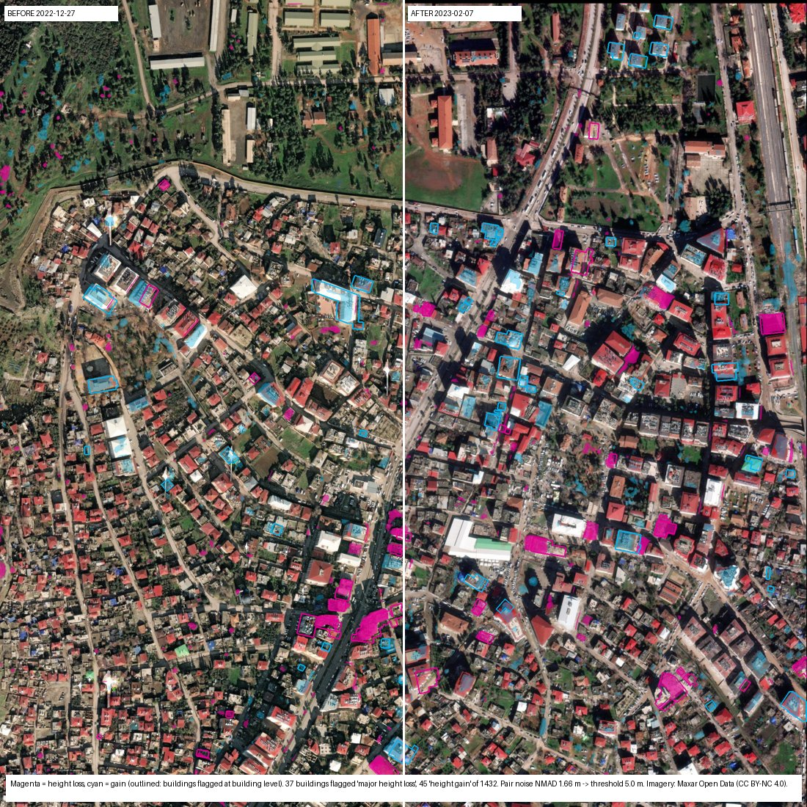
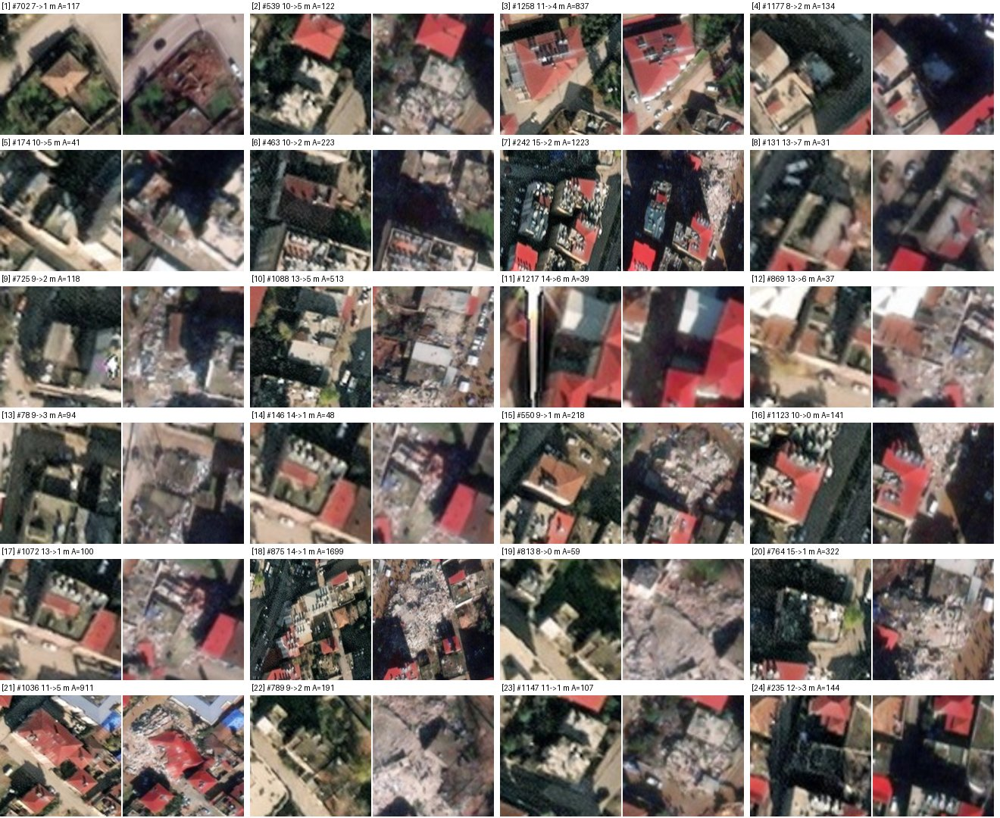

# Before / after 3D change screening — method and measured demo (Islahiye, Türkiye, 2023 earthquake)

DepthWizard compares two single-image height results of the same place taken at different dates. Collapsed or removed structures show as **height loss**; new structures or debris as **height gain**. It is a fast **screening** that directs attention (where to look first, which buildings to verify), **not** a damage assessment.

In the app, the steps are:

1. Process both images: two Mode B jobs.
2. Open **Before / after change screening** (panel 04b) on either result.
3. Say whether it is the before or the after image, pick the other image, and click **Compare**. It takes about 10 s on a CPU for a 1.2 km scene.

## Method (`core/change/detect.py`)

1. **Same grid.** The "after" nDSM and image are reprojected onto the "before" grid, which works for any CRS, pixel size and extent.
2. **Co-registration.** Phase correlation of the two high-passed images, upsampled to 0.1 px. The shift is applied only if it is ≤ 15 m and increases the normalised cross-correlation.
3. **Height difference.** dH = nDSM(after) − nDSM(before). The shared DEM cancels, so only structure above ground is compared.
4. **Thresholds come from the pair itself.** Most of any scene is unchanged, so the robust spread (NMAD) of dH over the scene measures the noise of this pair. That noise includes model error at both dates, residual misregistration and different view angles.
   * **Pixels:** a pixel changes when |dH| > max(3 × NMAD, 2.5 m), with a tolerance of 3 m horizontal displacement. A roof seen from two view angles moves by h·|tan a₁ − tan a₂|. Blobs under 8 m² are removed.
   * **Buildings** (the "before" LoD-1 footprints): the difference of footprint medians is compared with max(3 × NMAD over all buildings, 2.5 m).
   * **"Major height loss"** means a significant loss *and* at least half of the before height gone. This is consistent with collapse or removal.
5. **Outputs:**
   * height-change and change-class GeoTIFFs;
   * an overlay: magenta = loss, cyan = gain, with flagged buildings outlined;
   * the after image aligned to the before grid, shown with a swipe view;
   * a per-building table in GeoJSON and CSV;
   * every threshold and noise level used.

## Demo: Islahiye (Gaziantep, Türkiye), Mw 7.8 earthquake of 6 February 2023

`python scripts/fetch_change_demo.py` downloads the pair: Maxar Open Data, CC BY-NC 4.0.

| | Before | After |
|---|---|---|
| Date | 2022-12-27 | 2023-02-07 |
| Acquisition | WorldView 10300100E0287700 | WorldView 1040010082698700 |
| Off-nadir | 14.8° | 5.7° |
| Grid | 0.5 m on EPSG:32637, 1.2 × 1.2 km | same grid |

The DEM is Copernicus GLO-30. Heights come from the fine-tuned nDSM model v1, which was never trained on Turkish data. Building outlines are Microsoft ML footprints (ODbL), co-registered to the before image by 4.0 m (see docs/building_detection_validation.md).

**Measured on this pair.** To reproduce, process both demo images in the app and click Compare.

| Quantity | Value |
|---|---|
| Alignment | 4.7 m shift found and applied (image correlation 0.03 → 0.47) |
| Pair noise (NMAD) | 1.35 m per pixel · 1.66 m per building |
| Detection threshold | 4.1 m per pixel · 5.0 m per building |
| Buildings compared (footprints) | 1,432 |
| Major height loss / height loss / height gain | 37 / 2 / 45 |
| No significant change / not comparable | 1,343 / 5 |

**Visual audit of the flags.** A random sample of 24 of the 37 "major height loss" buildings was checked on the before and after images:

| Verdict | Count | What it was |
|---|---|---|
| Collapsed | 17 | rubble where a building stood (some partly, inside a merged footprint) |
| Uncertain | 3–4 | shadowed or unclear |
| False alarm | 3–4 | buildings still standing |

**Precision is about 71–88%.** An earlier run with image-detected outlines flagged 69 buildings (19 of 24 audited collapsed, 3 of them tree crowns). Footprints remove the tree alarms. About 8 collapsed buildings that are missing from the Microsoft dataset are no longer in the table, but they still appear in the pixel height-loss map. The "height gain" flags were also checked. The eight largest were intact buildings that the model read about 6 m taller in the after image, most likely because of the lower winter sun and longer shadows. Buildings do not grow in six weeks, so after a disaster a gain on an existing building is a model disagreement, not a real change. The app says so in its caveats and draws gains fainter than losses.

## Limits (stated in the app with every result)

* **Recall is not measured.** No reference damage map was used, so missed collapses are not counted. Pancake collapses that keep the roof level, and damage below the detection threshold, are expected misses.
* **False alarms:** different view angles, seasons (vegetation, snow), shadows, and construction between the dates.
* **Buildings missing from the footprint dataset** are not in the building table; their collapse still shows in the pixel loss map.
* **Heights come from single images.** Changes smaller than the reported thresholds (4–6 m here) cannot be detected.
* **Next step for a measured recall:** compare with an official grading map, such as Copernicus EMS or UNOSAT for this event.
